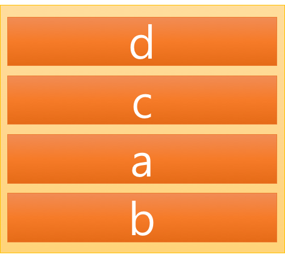

## 함수

### 스택의 개념

<u>스택은 한 쪽 끝에서만 자료를 넣거나 뺄 수 있는 선형 구조(LIFO, Last-In First=Out)</u>

*자료를 넣는 것을 Push, 넣어둔 자료를 꺼내는 것을 Pop


### 전역변수(Global variable)

전역변수는 전체 영역에서 접근할 수 있는 변수로 지역 변수는 호출할 때 발생되었다가 호출이 끝나면 종료되지만 전역변수는 데이터 영역에 저장되어 있다.

`전역변수 개념1`

```python
g_var = 10

def func():
	print('g_var = {}'.format(g_var))
	
if __name__=='__main__':
	func()	
	
>> g_var = 10
```

`전역변수 개념2`

```python
g_var = 10

def func():
	g_var = 20
	print('g_var(지역변수) = {} in func'.format(g_var))
	
if __name__=='__main__':
	func()	
	print('g_var = {} in func'.format(g_var))
	
>> g_var(지역변수) = 20 in func
>> g_var = 10 in func

```

### 지역변수(Local variable)

- 지역변수는 해당하는 함수 안에서만 사용
- 함수의 실행이 끝나면 그대로 사라진다.
- 함수에 들어오는 매개변수도 함수에서 지역변수처럼 인자를 받기 때문에 동일한 조건

```python
g_var = 10

def func():
	global g_var
	g_var = 20
	
if __name__=='__main__':
	print('before : {}'.format(g_var))	func()
	print('after : {}'.format(g_var))
	
>> before : 10
>> after : 20
```

이와 같은 결과를 비추어 정리하면 아래와 같다.

- 지역변수는 변수 안에서만 동작
- 실제로 출력되는 변수의 값은 일반적으로 전역변수
- 지역변수는 전역 변수를 변경한 것이 아니라 새로운 변수를 만들어 지역 변수로 할당

### 지역변수를 전역변수화(nonlocal)

- 지역변수와 그 안의 지역변수를 `nonlocal`을 사용하여 지역 변수를 새로 생성

```python
a = 1

def outer():
	b = 2
	c = 3
	print(a, b, c)
	def inner():
		d = 4
		e = 5
		print(a, b, c, d, e)
	inner()
	
if __name__=='__main__':
	outer()	


>> 1, 2, 3
>> 1, 2, 3, 4, 5
```

def inner 함수를 정의한 이후에 동일한 indent 위치에서 inner() 함수를 불러온 것은 inner() 함수를 사용하기 위함이다.

```python
a = 1

def outer():
	b = 2
	c = 3
	print(a, b, c)
	inner() # print(a, b, c, d, e)

if __name__=='__main__':
	outer()	

```

간단하게 위와 같은 구조로 실행이 된다.

**지역 변수를 재정의**

```python
def outer():
	a = 2
	b = 3
	
	def inner():
		nonlocal a
		a = 100
	inner()
	
	print('locals in outer: a = {}, b = {}'.format(a, b))
	
if __name__=='__main__':
	outer()
	
>> locals in outer: a = 100, b = 3	
```

- nonlocal 함수를 통해서 a = 2 를 a = 100으로 재정의하여 결과값을 출력

## 인자 전달 방식에 따른 분류

### 값에 의한 전달(call by value)

call by value 는 함수 호출을 하면 호출되는 변수의 값을 복사하여 함수의 인자로 전달

```c
include <iostream>
using namespace std;

void change_value(int x, int value)
{
    x = value;
    cout << "x : " << x << " in change_value" << end1;
}

int main(void)
{
    int x = 10;
    change_value(x, 20);
    cout << "x : " << x << " in main" << end1;
    
    return 0;
}


>> x : 20 in change_value
>> x : 10 in main
```





```c++
#include <iostream>
using namespace std;

int test(int a, int b);

int main(void)
{
    int a = 10, b = 5;
    int res = test(a, b);
    cout << "result of test : " << res << endl;
    return 0;
}

int test(int a, int b)
{
    int c = a + b;
    int d = a - b;
    return c + d;
}

```

## call by reference(참조에 의한 전달)

변수를 불러올 때 메모리의 값 자체를 복사하는 방식인 call by value 와는 달리 메모리의 주소값을 불러와서 값을 보여준다.

```c++
#include<iostream>
using namespace std;

void change_value(int *x, int value)
{
    *x = value;
    cout << "x : " << x << " in change_value" << endl;
}

int main(void)
{
    int x = 10;
    change_value(&x, 20);
    cout << "x : " << x << " in main" << endl;
}
```

```python
def change_value(x, value):
    x = value
    print('x : {} in change_value'.format(x))
    
if __name__=='__main__':
    x = 10
    change_value(x, 20)
    print('x : {} in main'.format(x))
```

```python
def func(li):
    li[0] = 'I am your father'
    
if __name__=='__main__':
    li = [1, 2, 3, 4]
    func(li)
    print(li)
```

```python
def func(li):
    li = ['I am your father']
    
if __name__=='__main__':
    li = [1, 2, 3, 4]
    func(li)
    print(li)
```

```python
def change_value(tu):
    tu = ('I am your father', 2, 3, 4)
    return tu

if __name__=='__main__':
    tu = (1, 2, 3, 4)
    print(tu)
    tu = change_value(tu)
    print(tu)
```