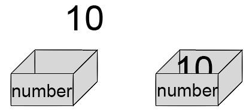

# 01. 변수

`변수(variable)` : 데이터를 저장할 수 있는 메모리 공간

* 변수는 단순한 이름이 아니라 메모리 공간 자체를 의미
* 문자, 숫자, 객체, 함수를 담을 수 있음
* 변수에 담긴 값이나 가리키는 대상은 언제라도 변경될 수 있다.

> 다른 언어에서의 변수와 파이썬에서의 변수는 차이가 있다.

```
int number = 10;
```
number란 `변수`에 10이라는 `값`이 담겨 있다.(다른 언어에서의 변수)




#### 파이썬에서의 변수: 이름과 값 객체

* 파이썬에서 쓰는 변수는 이름과 값 객체로 나눠진다.

* 우리가 파이썬에서 변수라고 부르는 것은 `이름`

```
>>> variable = 1 
```


variable이란 `이름`은 1이라는 `값 객체`를 가리킴

variable은 1이라는 값을 담고 있는 메모리 공간을 의미하지 않는다.

값 객체는 다른 메모리 공간에 있다.