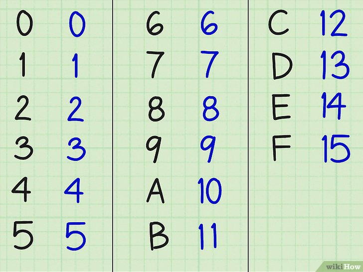

## 정수

1.1 <b>10진수</b>

* 수를 표한하는데 숫자를 총 열 개사용
* 밑수는 10, 0부터 9까지 총 열 개의 숫자로 모든 수를 표현

```
0,1,2,3,4,5,6,7,8,9 - 총 열 개의 숫자
```

1.2 <b>2진수</b>

* 숫자 0과 1만 사용
* 컴퓨터가 인식할 수 있는 표현 방법

```
0,1 - 두 개의 숫자
```

 <b>1.3 16진수</b>

* 숫자를 총 열여섯 개 사용
* 9 이후의 숫자는 알파벳 a~f로 표현
 
```
[0,1,2,3,4,5,6,7,8,9] - 열 개의 숫자
+
[a,b,c,d,e,f] - 여섯 개의 알파벳
= 총 열여섯 개의 숫자
```

2\. 진법 교환

2-1. <b>10진수 -> 2진수</b>


* `bin()`함수는 정수를 2진수로 표현하는 함수
 
```
>>> bin(25)
'0b11001' 
```
* `0b`는 2진수를 의미하는 binary

2-2. <b>2진수 -> 10진수</b>


<b>2-3. 16진수 -> 2진수</b>

* 16진수 한 자리는 0부터 f까지 최대 10진수 15까지 표현할 수 있다.



* 마지막 `15`를 2진수로 변환하면 `1111`
* 16진수 한 자리는 2진수 네 자릿수까지 표현할 수 있다.

```
f = 1111
```

* 16진수를 2진수로 변환할 때 0부터 9까지 변환하는 방법은 10진수에서 2진수로 변환할 때 쓰는 방법과 동일

* 16진수 a를 변환하는 방법은 10진수의 숫자로 변환
* `hex`함수는 정수를 16진수로 표현

# 3\.양의 정수
> 컴퓨터는  정수(integer)를 1바이트, 2바이트, 4바이트, 8바이트 등 다양한 크기로 저장

* 정수에는 양수와 음수가 있음
* 양수와 음수의 부호를 나타내는 데 1비트를 사용
* 맨 앞의 비트가 0이면 양수, 1이면 음수

```
양수 25를 메모리에 저장하는 방법

25를 2진수로 나타내면 11001
양수이기 때문에 맨 앞의 숫자는 0
나머지 비트는 0으로 채움
>>> 0001 / 1001
```
맨 앞의 비트가 부호를 나타낸다는 사실만 알고 있다면 10진수를 2진수로 변환한 것과 같다.

Q. 1바이트로 나타낼 수 있는 수의 크기는?


A. 정수에는 음수가 포함되고, 맨 앞의 비트를 부호로 사용하므로 표현할 수 있는 양수의 범위는 절반으로 줄어든다. 즉, 1바이트로 나타낼수 있는 수의 범위는 \-128~\127(음수를 취급하지 않고, 0~255를 나타낼 수 있는 정수 자료형도 있다.)


# 4\.음의 정수
보수? 쉽게 말해 '보충해 주는 수', 예를 들어 10진수에서 9의 보수를 구한다고 가정하면 3의 9의 보수는 3을 더해 9가 되는 수인 6, 26의 9의 보수는 73 어떤 수의 각 자릿수 수를 9에서 빼면 9의 보수를 구할 수 있다.
 
10의 보수? 3의 10의 보수는 3의 9의 보수인 6에서 1을 더한 값인 7
26의 10의 보수는 9의 보수인 73에 1을 더한 값인 74

<b>4-1. 2진수의 2의 보수</b>

* 2진수 1010의 1의 보수 -> 0101(1에서 각 자릿수를 뺌)
* 각 자릿수의 1과 0을 반전한 결과
* 2의 보수는 1의보수를 구한다음 1을 더함

4-2. 음수의 표현

음수 -4를 표현

```
0000 0100
1의 보수
1111 1011
2의보수
1111 1100

-4를 표현하는방법
1111 1100
```

<b>4-3. 2의 보수로 표현하는 이유</b>

0을 표현하는 두 가지 방법이 생김(+0, -0) 컴퓨터 입장에서 수 하나를 더 표현할 수 있는데 비트 하나를 낭비하는 셈. 또 두 수를 비교할 때 CPU에서 뺄셈을 하는데 +0과 -0을 비교하면 결과 값이 예상과 다르게 나옴

* 컴퓨터에서 정수의 뺄셈 과정

덧셈은 단순히 두 수를 더하면 되지만, 뺄셈은 2의 보수 개념을 활용,

9 - 4를 계산할 때 9에서 4를 빼는게 아니라 9와 -4를 더함

```
# 2진수 -> 16진수 변환

0000 / 0000

4개 단위로 잘라서 변환

# 2진수 -> 10진수 변환

0000 0000

위 변환방법처럼 각 자릿수
``` 


 