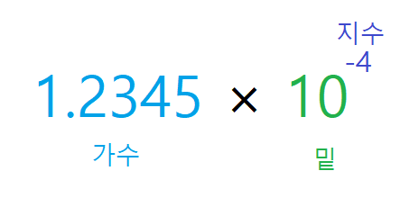
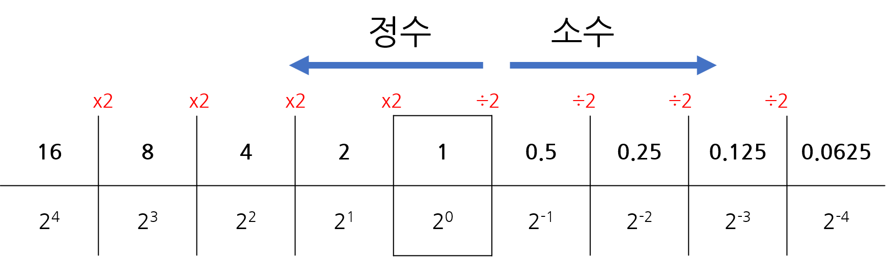
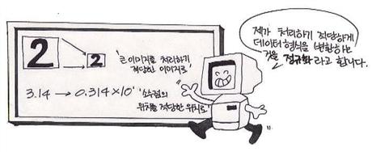

## 3. 실수
> 소수점이 떠다니는 것처럼 보이다고 해서 부동소수점이라고 부름

`단정도 부동소수점` : 실수를 32비트(4바이트)로 표현하며 부호 1비트, 지수부 8비트, 가수부 23비트로 구성

`배정도 부동소수점` : 실수를 64비트(8바이트)로 표현하며 부호 1비트, 지수부 11비트, 가수부 52빝트로 구성


* 실수를 표현하는 데 사용하는 비트 수가 단정도보다 배정도가 두 배 많은 만큼 정밀도가 높다.

* 파이썬은 배정도를 사용



`1.2345` : 가수(mantissa/fraction)

`10` : 밑수

`-4` : 지수


<b>3.1 10진수 실수를 2진수 실수로 바꾸기 </b> 




<b>3.2 정규화 </b>
> 소수점 왼쪽에 위치한 가수 부분을 밑수보다 작은 자연수가 되도록 만드는  것 



``` 
>> 1바이트 부동소수점

0 /0000/ 000

부호 / 지수부 / 가수부를 나타냄
0이면 양수 1이면 음수

```

* 부동소수점의 지수부에는 부호 비트가 없음(0~15의 양수만 나타낼 수 있음)
* 음수를 사용하려면 bias를 7로두고 지수부(exp)에서 bias를 뺀 값을 실제 지수로 사용

<b>3.3 1바이트 부동소수점의 표현범위</b>

|표현할 수 있는 가장 작은 수(지수부가 0001일 때|표현할 수 있는 가장 큰 수(지수부가 1110일 때)|
|---|---|
|1.000 * 2 ** -6	 = 0.015625| 1.111 * 2 ** 7 = 240|


### 표현 범위는 넓지만 정밀도는 낮다