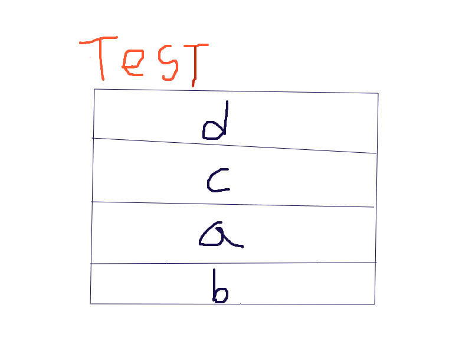
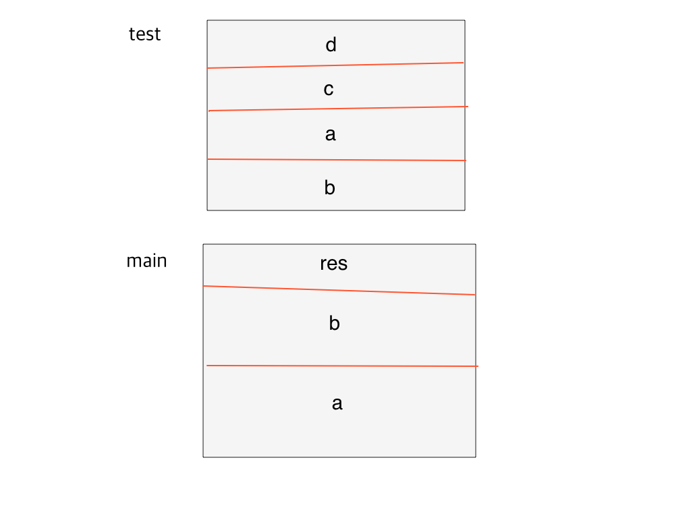
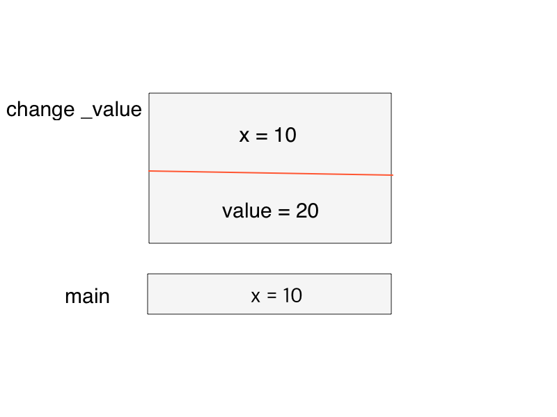
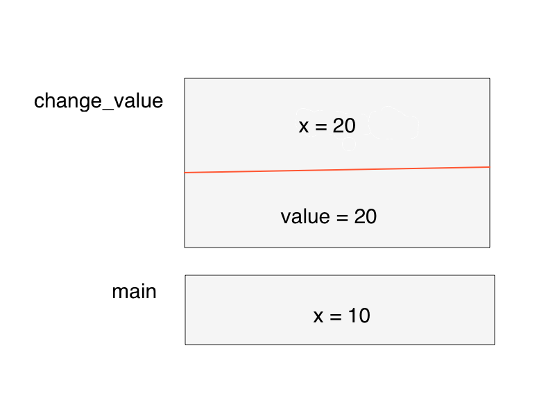
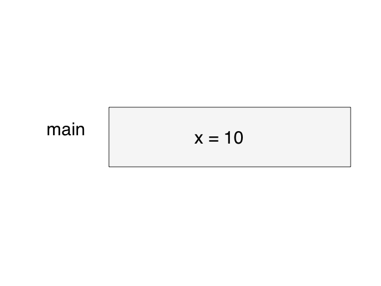

## 함수
> 스택 | 데이터를 저장할 땐 접시처럼 차곡차곡 쌓아 올리고, 맨 위부터 차례대로 내림

### 전역 변수
> 전체 영역에서 접근할 수 있는 변수

* 함수 안에서도 접근할 수 있어야 함

```
g_var = 10

def func():
    print("g_var = {}".format(g_var))

func()

g_var = 10
```

* 함수 안에서 전역 변수에 접근했고, 실행 결과 접근 가능하다는 것을 알 수 있음
* `g_var`는 전역변수 

```
g_var = 10

def func():
    g_var = 20
    print('g_var: {} in function'.format(g_var))

func()
print('g_var: {} in function'.format(g_var))

g_var: 20 in function
g_var: 10 in function
```
* 전역 변수 g_var를 선언
* 함수 안에서 g_var의 값을 변경
* 함수 내부에선 변경된 값이 print된것을 볼 수 있음
* 함수가 종료된 후 g_var는 변경되지 않은 값이 나옴

> g\_var가 바뀌지 않은 이유는 함수 내부의 g\_var를 변경하는 부분은 `전역변수`g\_var를 바꾸는게 아니라 함수 내부에서 또 다른 `지역변수`g\_var를 생성한 것이기 때문이다.

### 지역 변수
* 특정 지역에서만 접근 할 수 있는 변수
* 특정 역은 함수 내부를 의미
* 함수 안에서 선언한 변수가 `지역 변수`

`지역 변수`는 함수 바깥에서는 접근할 수 없고 함수가 호출될 때 생성되었다가 호출이 끝나면 사라짐

###### 함수 안에서 전역 변수를 변경 하는 코드

```
g_var = 10

def func():
    global g_var
    g_var = 20
    print('g_var: {} in function'.format(g_var))

func()
print('g_var: {} in function'.format(g_var))


g_var: 20 in function
g_var: 20 in function
```

* `global`키워드를 이용해서 전역 변수를 함수 내부에서 사용하겠다고 선언
* 함수 내부에 g_var=20의 코드는 g\_var라는 변수를 새로 생성하는 것이 아니라 전역변수 g\_var를 변경하는 것

##### 내부 함수에서의 지역변수

```
def outer():
    a=10
    def innter():
        b=20
```

* outer()함수에서 지역 변수 a가 선언
* 중첩된 함수 inner()함수에서 지역 변수 b가 선언

<b>inner()함수에서 outer()함수의 지역변수인 a를 변경할 수 있을까?</b>

```
a = 1

def outer():
    b = 2
    c = 3
    print(a,b,c)
    def inner():
        d = 4
        e = 5
        print(a,b,c,d,e)
    inner()
outer()

1 2 3
1 2 3 4 5
```

* inner() 함수에서는 전역 변수뿐만 아니라 outer() 함수의 공간에 있는 지역 변수에도 접근할 수 있음
* inner()에서 b와 c를 변경하려면 새로운 변수를 생성(global을 쓰지 않고 전역 변수를 변경하려 할 때와 동일)
* `nonlocal` 키워드를 사용해 inner()함수에서 outer()함수의 지역변수를 사용한다고 선언

```
def outer():
    a = 2
    b = 3
    print(a,b)
    def inner():
        nonlocal a
        a = 100
    inner()
    
    print('locals in outer : a = {}, b = {}'.format(a,b))
outer()

2 3
locals in outer : a = 100, b = 3
```
## 인자 전달 방식에 따른 분류
> call by value, call by reference
> 
> 파이썬은 둘 다 사용하지 않기 때문에 예제는 C++ 코드로 대체

1. 값에 의한 전달(call by value)
 
```
#include <iostream>
using namespace std;

void change_value(int x, int value)
{
	x = value;
	cout << "x : " << x << " in change_value" << end1;
}

int main(void)
{
	int x = 10;
	change_value(x, 20)
	cout << "x : " << x << " in main" << end1;
	
	return 0;
}

x : 20 in change_value
x : 10 in main	
```

* change_value()함수는 인자 x와 value를 받아 x에 value를 대입
* main()함수에서 지역 변수 x에 10을 대입한 다음 change_value() 함수를 호출하면서 value인자로 20을 전달
* 지역 변수 x값은 20으로 바뀔것이라 예상

1. 함수 안에서는 값이 변경됨
2. main()에서는 변경되지 않은걸 확인할 수 있다.

<b>Why?</b>
> 함수에 x가 전달될 때 값에 의한 전달 방식으로 전달되었기 때문

함수가 호출될때 메모리에는 `스택 프레임`이 생김

`스택 프레임`: 함수의 메모리 공간(지역 변수)가 존재하는 영역

```
#include <iostream>
using namespace std;

int test(int a, int b);

int main(void)
{
	int a = 10, b = 5;
	int res = test(a, b);
	cout << "result of test : " << res << end1;
	return 0
}

int test(int a, int b)
{
	int c = a + b;
	int d = a - b;
	return c + d;
}
```

* test()함수는 인자로 a와 b를 받음
* 지역 변수로 c와 d를 선언

test()함수를 호출하면 생기는 스택프레임



* main() 함수도 함수이므로 스택 프레임을 갖는다.

test()함수를 호출한 main()함수까지 확장한 모습



* main() 함수가 먼저 실행되므로 스택 프레임이 먼저 쌓임
* main() 함수 안에서 호출한 test() 함수의 스택 프레임은 그 위에 쌓임
* test()함수가 모두 실행되면 test() 함수의 스택 프레임이 먼저 사라지고, 이후에 프로그램이 종료되면 main() 함수의 스택 프레임이 사라짐
* main()과 test()함수의 스택프레임 공간에 a,b가 있음
* 두 공간은 독립된 공간
* main()함수 스택 프레임의 지역변수인 a,b를 전달한 것 같지만, 실제로는 test()함수 스택 프레임의 지역 변수 a,b에 값만 `복사`한 것

<b>인자를 전달할 때 값을 복사해 전달하는 경우를 `값에 의한 전달(call by value)`라고 함</b>


change_value 스택 프레임1(call\_by\_value)



* change_value() 함수 스택 프레임의 x와 main() 함수 스택 프레임의 x는 서로 다른 메모리 공간에 존재하는 서로 다른 변수
* 값만 10으로 같을 뿐이다

change_value 스택 프레임2



* x에 value값을 대입했으므로 x 값은 20
* main()과 change_value()에 있는 x는 서로 다른 변수이므로 main()함수의 지역 변수 x 값은 변하지 않음
* change_value()함수는 change_value 스택 프레임의 지역 변수 x값인 20을 출력하고, 실행이 끝나면 스택 프레임은 사라짐

change_value 실행 종료 후 스택 모습




* 이 상태에서 x를 출력하면 10이 출력
* 인자를 값에 의한 전달 방식으로 했기 때문에 change_value함수 이후에도 main()에 x의 값은 변하지 않음


2\.참조에 의한 전달
> 인자를 전달할 때 값을 전달하는게 아니라 참조를 전달

```
#include <iostream>
using namespace std;

void change_value(int *x, int value)
{
    *x = value;
    cout << "*x : " << *x << " in change_value" << end1;
}

int main(void)
{
    int x = 10;
    change_value(&x, 20)
    cout << "x : " << x << " in main" << end1;
    
    return 0;
}

x : 20 in change_value
x : 20 in main
``` 
* 함수 인자 목록에서 int x가 int *x
* x = value;가 *x = value;
* change\_value(x, 20)이 change\_value(&x, 20)으로 바뀜
* 실행 결과 x의 값이 바뀜
* 


