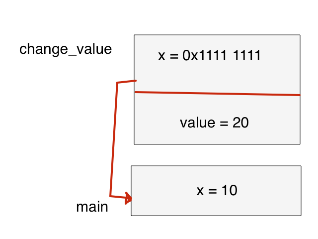
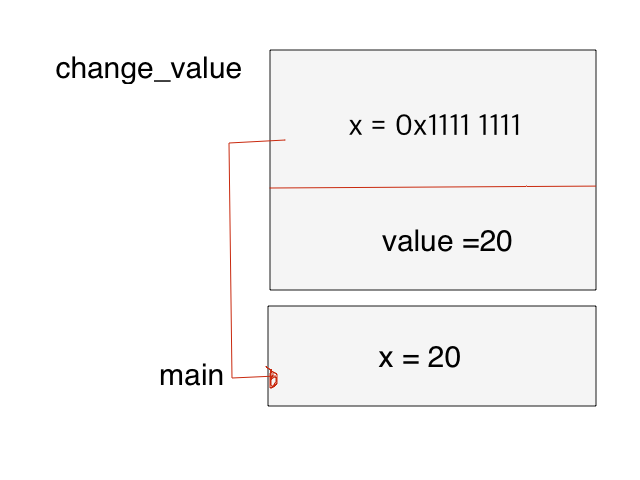
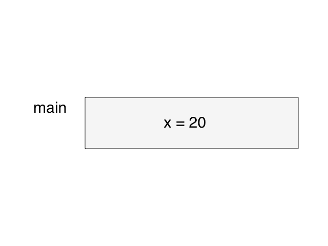
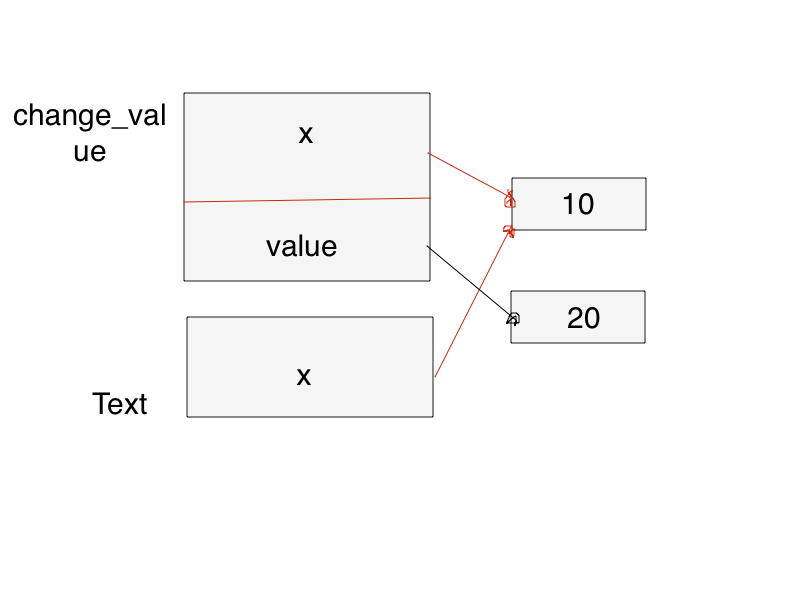
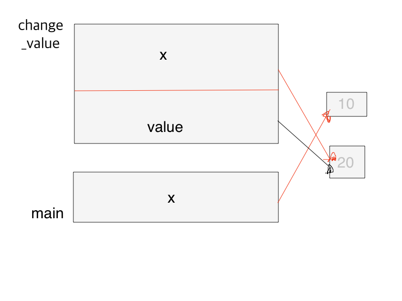
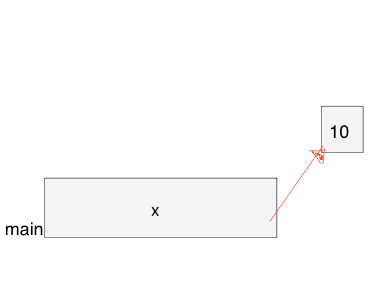
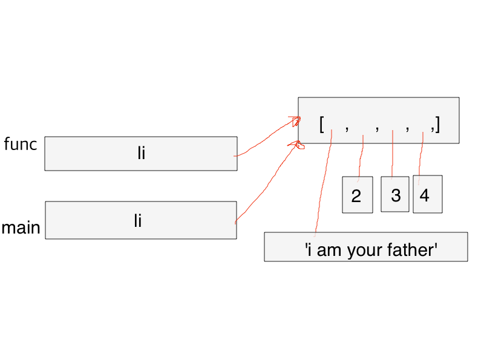
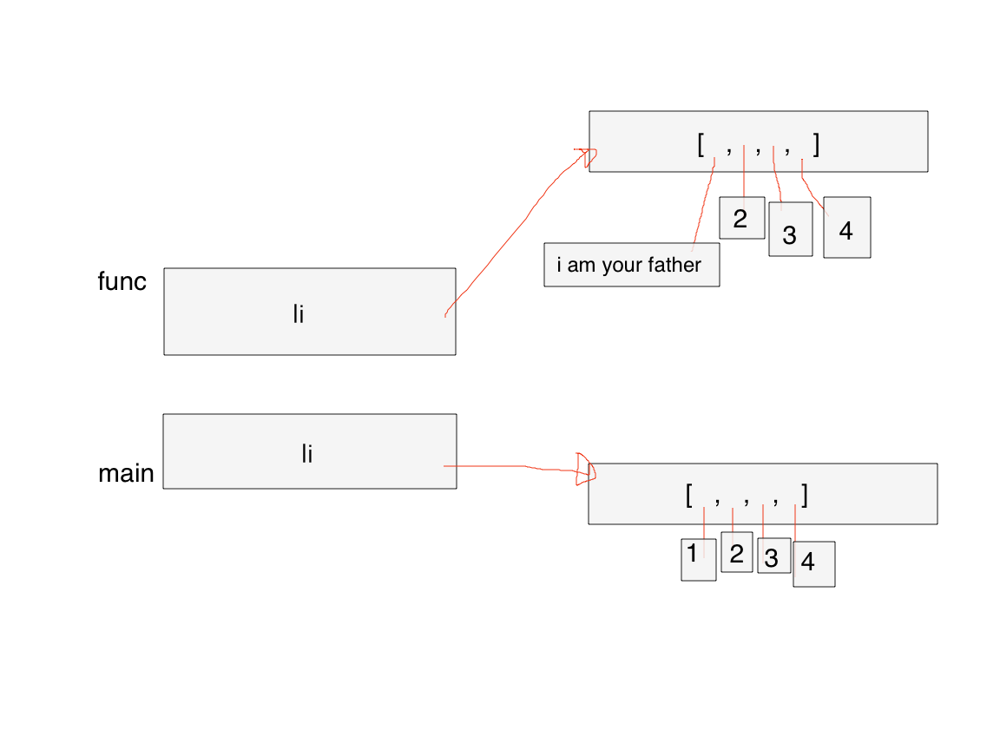

## 함수
> 스택 | 데이터를 저장할 땐 접시처럼 차곡차곡 쌓아 올리고, 맨 위부터 차례대로 내림

### 전역 변수
> 전체 영역에서 접근할 수 있는 변수

* 함수 안에서도 접근할 수 있어야 함

```
g_var = 10

def func():
    print("g_var = {}".format(g_var))

func()

g_var = 10
```

* 함수 안에서 전역 변수에 접근했고, 실행 결과 접근 가능하다는 것을 알 수 있음
* `g_var`는 전역변수 

```
g_var = 10

def func():
    g_var = 20
    print('g_var: {} in function'.format(g_var))

func()
print('g_var: {} in function'.format(g_var))

g_var: 20 in function
g_var: 10 in function
```
* 전역 변수 g_var를 선언
* 함수 안에서 g_var의 값을 변경
* 함수 내부에선 변경된 값이 print된것을 볼 수 있음
* 함수가 종료된 후 g_var는 변경되지 않은 값이 나옴

> g\_var가 바뀌지 않은 이유는 함수 내부의 g\_var를 변경하는 부분은 `전역변수`g\_var를 바꾸는게 아니라 함수 내부에서 또 다른 `지역변수`g\_var를 생성한 것이기 때문이다.

### 지역 변수
* 특정 지역에서만 접근 할 수 있는 변수
* 특정 역은 함수 내부를 의미
* 함수 안에서 선언한 변수가 `지역 변수`

`지역 변수`는 함수 바깥에서는 접근할 수 없고 함수가 호출될 때 생성되었다가 호출이 끝나면 사라짐

###### 함수 안에서 전역 변수를 변경 하는 코드

```
g_var = 10

def func():
    global g_var
    g_var = 20
    print('g_var: {} in function'.format(g_var))

func()
print('g_var: {} in function'.format(g_var))


g_var: 20 in function
g_var: 20 in function
```

* `global`키워드를 이용해서 전역 변수를 함수 내부에서 사용하겠다고 선언
* 함수 내부에 g_var=20의 코드는 g\_var라는 변수를 새로 생성하는 것이 아니라 전역변수 g\_var를 변경하는 것

##### 내부 함수에서의 지역변수

```
def outer():
    a=10
    def innter():
        b=20
```

* outer()함수에서 지역 변수 a가 선언
* 중첩된 함수 inner()함수에서 지역 변수 b가 선언

<b>inner()함수에서 outer()함수의 지역변수인 a를 변경할 수 있을까?</b>

```
a = 1

def outer():
    b = 2
    c = 3
    print(a,b,c)
    def inner():
        d = 4
        e = 5
        print(a,b,c,d,e)
    inner()
outer()

1 2 3
1 2 3 4 5
```

* inner() 함수에서는 전역 변수뿐만 아니라 outer() 함수의 공간에 있는 지역 변수에도 접근할 수 있음
* inner()에서 b와 c를 변경하려면 새로운 변수를 생성(global을 쓰지 않고 전역 변수를 변경하려 할 때와 동일)
* `nonlocal` 키워드를 사용해 inner()함수에서 outer()함수의 지역변수를 사용한다고 선언

```
def outer():
    a = 2
    b = 3
    print(a,b)
    def inner():
        nonlocal a
        a = 100
    inner()
    
    print('locals in outer : a = {}, b = {}'.format(a,b))
outer()

2 3
locals in outer : a = 100, b = 3
```
## 인자 전달 방식에 따른 분류
> call by value, call by reference
> 
> 파이썬은 둘 다 사용하지 않기 때문에 예제는 C++ 코드로 대체

1. 값에 의한 전달(call by value)
 
```
#include <iostream>
using namespace std;

void change_value(int x, int value)
{
	x = value;
	cout << "x : " << x << " in change_value" << end1;
}

int main(void)
{
	int x = 10;
	change_value(x, 20)
	cout << "x : " << x << " in main" << end1;
	
	return 0;
}

x : 20 in change_value
x : 10 in main	
```

* change_value()함수는 인자 x와 value를 받아 x에 value를 대입
* main()함수에서 지역 변수 x에 10을 대입한 다음 change_value() 함수를 호출하면서 value인자로 20을 전달
* 지역 변수 x값은 20으로 바뀔것이라 예상

1. 함수 안에서는 값이 변경됨
2. main()에서는 변경되지 않은걸 확인할 수 있다.

<b>Why?</b>
> 함수에 x가 전달될 때 값에 의한 전달 방식으로 전달되었기 때문

함수가 호출될때 메모리에는 `스택 프레임`이 생김

`스택 프레임`: 함수의 메모리 공간(지역 변수)가 존재하는 영역

```
#include <iostream>
using namespace std;

int test(int a, int b);

int main(void)
{
	int a = 10, b = 5;
	int res = test(a, b);
	cout << "result of test : " << res << end1;
	return 0
}

int test(int a, int b)
{
	int c = a + b;
	int d = a - b;
	return c + d;
}
```

* test()함수는 인자로 a와 b를 받음
* 지역 변수로 c와 d를 선언

test()함수를 호출하면 생기는 스택프레임


* main() 함수도 함수이므로 스택 프레임을 갖는다.

test()함수를 호출한 main()함수까지 확장한 모습


* main() 함수가 먼저 실행되므로 스택 프레임이 먼저 쌓임
* main() 함수 안에서 호출한 test() 함수의 스택 프레임은 그 위에 쌓임
* test()함수가 모두 실행되면 test() 함수의 스택 프레임이 먼저 사라지고, 이후에 프로그램이 종료되면 main() 함수의 스택 프레임이 사라짐
* main()과 test()함수의 스택프레임 공간에 a,b가 있음
* 두 공간은 독립된 공간
* main()함수 스택 프레임의 지역변수인 a,b를 전달한 것 같지만, 실제로는 test()함수 스택 프레임의 지역 변수 a,b에 값만 `복사`한 것

<b>인자를 전달할 때 값을 복사해 전달하는 경우를 `값에 의한 전달(call by value)`라고 함</b>


change_value 스택 프레임1(call\_by\_value)


* change_value() 함수 스택 프레임의 x와 main() 함수 스택 프레임의 x는 서로 다른 메모리 공간에 존재하는 서로 다른 변수
* 값만 10으로 같을 뿐이다

change_value 스택 프레임2


* x에 value값을 대입했으므로 x 값은 20
* main()과 change_value()에 있는 x는 서로 다른 변수이므로 main()함수의 지역 변수 x 값은 변하지 않음
* change_value()함수는 change_value 스택 프레임의 지역 변수 x값인 20을 출력하고, 실행이 끝나면 스택 프레임은 사라짐

change_value 실행 종료 후 스택 모습


* 이 상태에서 x를 출력하면 10이 출력
* 인자를 값에 의한 전달 방식으로 했기 때문에 change_value함수 이후에도 main()에 x의 값은 변하지 않음


2\.참조에 의한 전달
> 인자를 전달할 때 값을 전달하는게 아니라 참조를 전달

```
#include <iostream>
using namespace std;

void change_value(int *x, int value)
{
    *x = value;
    cout << "*x : " << *x << " in change_value" << end1;
}

int main(void)
{
    int x = 10;
    change_value(&x, 20)
    cout << "x : " << x << " in main" << end1;
    
    return 0;
}

x : 20 in change_value
x : 20 in main
``` 
* 함수 인자 목록에서 int x가 int *x
* x = value;가 *x = value;
* change\_value(x, 20)이 change\_value(&x, 20)으로 바뀜
* 실행 결과 x의 값이 바뀜

change_value 스택 프레임1



* int *는 int형 포인터를 의미
* &x로 인자를 전달, 이는 mian()함수 스택 프레임의 변수 x가 위치한 메모리 공간의 첫 번재 바이트 주소 값을 전달한다는 의미
* 값 10을 전달하는 게 아니라 데이터 10을 저장하고 있는 4바이트 공간(int형은 정수형 자료형으로 4바이트를 차지)중 첫 번째 바이트의 주소 값을 전달
* int *x는 포인터 변수를 의미함
* 포인터 변수도 다른 변수처럼 데이터를 저장
* 포인터 변수에 저장된 데이터는 값이 아닌 메모리 주소
* change_value()함수 스택 프레임의 포인터 변수 x는 &x를 통해 main()함수 스택 프레임 안의 `지역 변수 x의 주소 값을 저장`
* 인자로 변수의 참조를 전달하는 방식을 `참조에 의한 전달(call by reference)`라고 한다.

chagne_value함수가 실행된 뒤 *x = value가 실행됐을 때의 스택 프레임



* `*x = value`에서 `*x`를 역참조라고 하며, x에 저장된 주소 값인 0x1111 1111로 접근
* 주소 값으로 접근하여 value를 대입하면 main() 함수의 지역 변수 x가 있는 메모리 공간에 value값을 대입할 수 있다

change_value 실행 종료 후의 스택 프레임



* 함수에 참조를 인자로 전달함으로써 main()함수 스택 프레임의 변수 x값을 변경


### 객체 참조에 의한 전달(파이썬) - 변경 불가능 객체를 전달
> 파이썬은 객체 참조에 의한 전달(call by object reference)이라는 특별한 방식으로 인자를 전달

* 파이썬에서는 함수를 호출할 때 인자로 전달된 객체를 일단 참조
* 참조에 의한 전달과 비슷

```
def change_value(x, value): #3
    x = value               #4
    print(f'x: {x} in change_value')

x = 10						#1
change_value(x, 20)		    #2
print(f'x: {x} in main')

x: 20 in change_value
x: 10 in main
```

* \#2에서 change_value() 함수를 호출 하면서 인자로 #1의 x를 전달
* 이 때 change_value 스택 프레임이 생성되면서 #3의 인자 x는 함수를 호출한 영역에 있는 #1의 x를 참조

\#4를 실행하기전 스택 프레임



##### 파이썬의 변수는 C 언어처럼 변수라는 메모리 공간에 값을 직접 저장하지 않는다.

* 변수 이름이 값 객체를 가리킴
* 참조에 의한 전달 방식과 비슷해보이지만, 결과 값을 보면 참조에 의한 전달 방식은 아니라는것을 알 수 있다.
* 함수 스택 프레임 안에서는 x값이 변경되었지만, 함수를 호출한 쪽에서는 x 값이 변경되지 않았다.

\#4를 실행한 모습



* 상수 객체는 변경 불가능 객체
* 변수 값을 바꾼다는 의므는 변수 이름이 가리키는 메모리 공간의 값을 직접 바꾸는 게 아니라 바꾸고자 하는 상수 객체를 참조하는 것
* \#4는 value가 가리키는 상수 객체를 참조하게 하는코드
* 다음 행에서 출력하면 x는 20이라고 나옴

change_value()함수의 호출을 완료한 다음에 살펴본 스택 프레임




* change\_value 스택 프레임이 사라지면서 change_value()함수의 지역 변수 x와 value가 사라짐
* 레퍼런스 카운트(reference count)가 0이 된 상수 객체 20도 사라짐
* x를 출력하면 10이 나옴
* 값에 의한 전달방식이나 참조에 의한 전달 방식은 아니라는 것을 알 수 있다.

### 레퍼런스 카운트?

* 메모리 영역 중에는 힙(heap)이라는 공간이 있다.
* C/C++에서는 힙에 할당한 메모리는 프로그래머가 직접 해제해야 함
* python, java, C# 등에서는 메모리를 프로그래머가 직접 관리하지 않는다.(해당 언어가 스스로 해제)
* 더는 사용하지 않는 메모리를 언어 차원에서 해제한다는 개념을`가비지 컬렉션(grrbage collection)이라고 한다`
* python은 레퍼런스 카운팅으로 가비지 컬렉션을 구현

### 객체 참조에 의한 전달(파이썬) - 변경 가능 객체를 전달

```
def func(li):
    li[0] = 'I am your father!' #1

li = [1,2,3,4]
func(li)
print(li)

['I am your father!', 2, 3, 4]
```

* 이 코드는 함수 안에서 리스트 li의 0번 인덱스의 값을 변경(#1)
* 실행 결과 변경되지 않는 상수와는 다르게 리스트의 요소가 변경

```
def func(li):
    li = ['I am your father!',2,3,4]	#1

li = [1,2,3,4]
func(li)
print(li)

[1, 2, 3, 4]
```

* 함수 안에서 리스트 li에 새로운 리스트를 통째로 할당(#1)

위 코드와 아래 코드의 차이점

1. 위 코드: 참조한 리스트에 접근해 변경을 시도
2. 아래 코드: 아예 다른 리스트를 메모리 공간에 새로 만든 다음 이를 참조해 리스트를 변경

두 예제 코드의 차이점

위 코드에서 #1을 실행한 뒤 스택 프레임



* func 스택 프레임의 li와 main 스택 프레임의 li가 모두 `같은 메모리 공간을 참조`
* 변경 불가능 객체는 값을 바꾸려면 다른 메모리 공간에 새로운 객체를 만든 다음에 참조를 통해 새로 만든 객체를 가리키게 만드는 방법밖에 없음(ex 튜플의 값을 변경하려면 새로운 튜플을 만드는 수밖에 없음)
* 리스트는 변경 가능 객체
* 리스트의 첫번째 요소 값을 변경할 때 값 객체만 새로운 공간에 만들어 참조하면 됨
* 값을 변경하기 위해 리스트 자체를 다른 메모리 공간에 새로 할당할 필요가 없음

아래 코드의 #1을 실행한 모습



* 다른 메모리 공간에 새로운 리스트를 만들어 li로 참조
* 요소가 아니라 리스트 자체를 변경
* 함수 호출이 끝나면 func 스택 프레임이 사라지면서 새로 만들어진 리스트는 삭제
* main의 지역 변수인 리스트 li는 변경되지 않음

##### 정리

1. 함수 인자로 변경 불가능 객체를 전달해 값을 변경할 수 없다.
	* 함수 안에서 새 객체를 만든 다음 참조하여 바꾸려 하면 함수 호출이 끝나고 스택 프레임이 사리지면서 참조도 사라지기 때문
2. 함수 내부에서 객체를 새롭게 할당해야만 값을 변경할 수 있는 객체는 변경 불가능 객체인 상수, 문자열, 튜플
3. 리스트나 딕셔너리 같은 변경 가능 객체도 함수 안에서 새로운 객체를 만들 경우 함수 호출이 끝나면서 객체는 사라진다.
4. 위와 같은 이유로 변경 가능 객체를 인자로 전달할 때도 인자로 전달된 객체에 접근하여 변경 해야만 함수를 호출한 쪽의 객체를 변경할 수 있다.

### 이러한 파이썬의 인자 전달 방식을 객체 참조에 의한 전달(call by object reference)방식이라고 한다.

! 변경 불가능 객체를 함수 인자로 전달해 변경하는 방법

```
def change_value(tu):
    tu = ('I am your father, 2, 3, 4') #2
    return tu						   #3

tu = (1,2,3,4)						   #1
tu = change_value(tu)				   #4
print(tu)

I am your father, 2, 3, 4
```

* \#1의 튜플을 #4에서 함수 인자로 전달
* \#2를 보면 함수 안에서 새로운 튜플을 할당
* change_value() 함수 안에 있는 지역 변수 tu가 이를 참조
* \#3 에서 지역 변수 tu를 반환
* \#4 에선 함수를 호출한 쪽의 tu에 반환값을 대입
* 함수 호출이 끝나더라도 함수 안에서 할당된 객체를 함수를 호출한 쪽의 tu가 참조하므로 사라지지 않고 tu값도 변경

## 람다 함수
> 이름이 없는 함수

* 다음 행으로 넘어가면 다시 사용할 수 없음
* 자주 사용할 함수가 아니라면 필요할 때 람다 함수로 만들어 사용하면 됨

```
li = [i for i in range(1,11)]
li
[1, 2, 3, 4, 5, 6, 7, 8, 9, 10]

li.sort(key=lambda x: x%2==0) 	#1
li
[1, 3, 5, 7, 9, 2, 4, 6, 8, 10]
```

* li는 1부터 10까지의 정수가 순차적으로 나열된 리스트
* 2의 배수와 2의 배수가 아닌 수로 나누고 싶을땐 #1
* key 인자에 람다 함수를 전달
* 2의 배수가 아니라면 False이므로 0, 2의 배수이면 True이므로 1이 됨
* 결과 값이 오름차순으로 정렬되면 2의 배수가 뒤에 배치
* 람다 함수를 사용해 편리하게 정렬 기준을 제공할 수 있음

변수 f에 람다 함수를 참조하면 f를 함수처럼 사용할 수 있음

```
f = lambda x: x ** 2
f(2)
4

f = lambda x: x ** 2
f(5)
25
```

* 람다 함수에는 값을 반환하는 return문이 없음
* 람다 함수의 몸체에는 반드시 식이 들어가야 함
