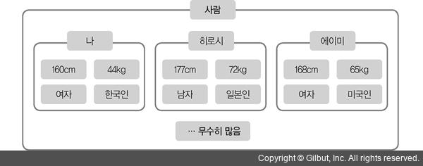

##### 프로그래밍 패러다임

* 절차 지향 프로그래밍(procedural programming)
* 객체 지향 프로그래밍(object-oriented programming)
* 함수형 프로그래밍

`패러다임` : 어떤 사물을 바라보는 사고의 틀이나 체계

## 절차 지향 프로그래밍
> 한 번 정의해 두면 어디서든 다시 호출해 사용할 수 있고 이름만 봐도 이 함수가 어떤 일을 하는지 쉽게 알 수 있음

`프로시저(procedure)` : 서브루틴, 메서드, 함수라고 불림

* 함수의 내부 구현은 알 필요 없이 사용법(인터페이스)만 익혀 사용하면 됨
* 긴 코드를 기능별로 나누어 함수를 정의, 함수 호출을 사용해 코드를 작성하면 다른 프로그래머도 쉽게 프로그램을 이해하고 유지,보수할 수 있다.

##### '이 프로그램은 어떤 일을 하는가?'에 대한 질문에 쉽게 답할 수 있도록 함수(프로시저)를 사용해 프로그래밍 하는것이 `절차 지향 프로그래밍`이라고 한다.

### 절차 지향으로 학급 서적 평가 프로그램 만들기

1. 엑셀 파일과 시트 불러오기

```
>>> from openpyxl import * # openpyxl모듈을 불러옴
>>> wb = load_workbook('exam.xlsx') # exam.xlsx를 open
>>> print(wb.sheetnames) 
['시트1']
>>> ws = wb.active # 활성화 된 시트를 받아옴
>>> print(ws)
[Worksheet '시트']
```
2\. 엑셀 파일의 셀들을 불러오기

```
>>> g = ws.rows # 데이터가 있는 모든 행을 발생자(generator)객체로 반환
>>> cells = next(g) # 첫번째 행을 가져 옴
>>> cells
(<Cell '시트1'.A1>, <Cell '시트1'.B1>, <Cell '시트1'.C1>, <Cell '시트1'.D1>)
```

* 1행에는 학생 이름과 과목명
* 1행을 학생 데이터를 담을 딕셔너리의 키(key)로 사용

```
>>> keys = []
>>> for cell in cells:
>>>     keys.append(cell.value) # 셀의 value에 접근, 실제 값을 가져옴
>>> keys
['name', 'math', 'literature', 'science']
```

* 학생들의 데이터를 가져와 딕셔너리에 저장

```
>>> student_data = []
>>> for row in g:
       dic = {k : c.value for k, c in zip(keys, row)} # 딕셔너리 컴프리헨션을 이용, 학생 한 명의 데이터를 모은 딕셔너리를 만듬
       student_data.append(dic) # 전체 학생 데이터를 저장하는 리스트 student_data에 추가
>>> student_data
[{'name': 'greg', 'math': 95, 'literature': 65, 'science': 75},
 {'name': 'john', 'math': 25, 'literature': 30, 'science': 55},
 {'name': 'yang', 'math': 50, 'literature': 45, 'science': 40},
 {'name': 'timothy', 'math': 15, 'literature': 65, 'science': 90},
 {'name': 'melisa', 'math': 100, 'literature': 100, 'science': 100},
 {'name': 'thor', 'math': 10, 'literature': 15, 'science': 20},
 {'name': 'elen', 'math': 25, 'literature': 50, 'science': 100},
 {'name': 'mark', 'math': 80, 'literature': 75, 'science': 80},
 {'name': 'steve', 'math': 95, 'literature': 100, 'science': 95},
 {'name': 'anna', 'math': 20, 'literature': 20, 'science': 20}]
```

##### 평균, 분산, 표준편차를 함수로 만들기

* 함수를 쓰지 않은 코드

```
>>> for name, score in g:
        raw_data[name.value] = score.value

>>> scores = list(raw_data.values()) 
>>> scores

>>> s = 0

>>> for score in scores:
        s += score

>>> avrg = round(s/len(scores), 1)

>>> s = 0

>>> for score in scores:
        s += (score - avrg) ** 2
    
>>> variance = round(s/len(scores), 1)

>>> std_dev = round(math.sqrt(variance), 1)

>>> print(
        '평균: {0}, 분산: {1}, 표준편차: {2}'.format(
        avrg, variance, std_dev)
    )

>>> if avrg < 50 and std_dev > 20:
        print('성적이 너무 저조하고 학생들의 실력 차이가 너무 크다')
>>> elif avrg > 50 and std_dev > 20:
        print('성적은 평균 이상이지만 학생들이 실력 차이가 크다. 주의 요망!')
>>> elif avrg < 50 and std_dev < 20:
        print('학생들의 실력 차이는 크지 않지만 성적이 너무 저조하다. 주의 요망!')
>>> elif avrg > 50 and std_dev < 20:
        print('성적도 평균 이상이고 학생들의 실력 차이도 크지 않다.')

평균: 51.5, 분산: 1240.2, 표준편차: 35.2
성적은 평균 이상이지만 학생들이 실력 차이가 크다. 주의 요망!
```

## 위 코드를 절차 지향으로 바꾸기

* 실행에 필요한 함수를 모아 둘 function.py를 만듬
* sequential.py를 기능별로 쪼개 함수로 만듬

1. 파일의 데이터를 읽어오는 부분

```
>>> raw_data = {}
>>> wb = openpyxl.load_workbook('class_2_3.xlsx')
>>> ws = wb.active
>>> g = ws.grows

>>> for name, score in g:
        raw_data[name.value] = score.value
```

1-1. 함수로 변환

```
>>> import openpyxl
>>> import math

>>> def get_data_from_excel(filename):
		 """
		 get_data_form_excel(filename) -> {'name1':'score1','name2':'score2'...}
		 엑셀 파일에서 데이터를 가져옴
		 반환값은 key가 학생 이름이고 value가 점수인 딕셔너리
		 """
>>>	 	dic = {}
>>>		wb = openpyxl.load_workbook(filename)
>>>		ws = wb.active
>>>		g = ws.rows
>>>
>>> 	for name, score in g:
>>> 		dic[name.value] = score.value
>>> 
>>> 	return dic 
```

* get_dic_data_from_excel() 함수는 인자로 엑셀 파일의 이름을 받고, 파일에서 데이터를 읽어와 딕셔너리에 담아 반환

2\. 평균,분산,표쥰편차를 구하는 부분

```
>>> s = 0

>>> for score in scores:
        s += score

>>> avrg = round(s/len(scores), 1)

>>> s = 0

>>> for score in scores:
        s += (score - avrg) ** 2
    
>>> variance = round(s/len(scores), 1)

>>> std_dev = round(math.sqrt(variance), 1)
```

2-1. 함수화

```
>>> def average(score):
>>> 	s = 0

>>> 	for score in scores:
        	s += score

>>> 	return round(s/len(scores), 1)


>>> def variance(scores, avrg):
>>> 	s = 0

>>> 	for score in scores:
        	s += (score - avrg) ** 2
    
>>> 	reutrn round(s/len(scores), 1)

>>>	 def std_dev(variance):
>>>		return roind(math.sqrt(variance), 1)
```

* 위 함수는 통계 관련 프로그램에서 평균,분산,표준편차를 구할 때 사용할 수 있다.
* 프로그래머가 분산이나 표준편차 식을 모른다고 해도 함수를 호출해 값을 얻을 수 있다.
* 함수 정의를 통해 인터페이스와 구현이 분리되었기 때문

3\. 평가 출력 부분

```
>>> def evaluateClass(avrg, total_avrg, std_dev, sd):
>>> 	"""
>>> 	evaluateClass(avrg, total_avrg, std_dev, sd) -> None
>>>		avrg: 반 성적 평균
>>>		total_avrg: 학년 전체 성적 평균
>>>		std_dev: 반의 표쥰편차
>>>		sd: 원하는 표준편차 기준 
	 	"""
>>> if avrg < 50 and std_dev > 20:
        print('성적이 너무 저조하고 학생들의 실력 차이가 너무 크다')
>>> elif avrg > 50 and std_dev > 20:
        print('성적은 평균 이상이지만 학생들이 실력 차이가 크다. 주의 요망!')
>>> elif avrg < 50 and std_dev < 20:
        print('학생들의 실력 차이는 크지 않지만 성적이 너무 저조하다. 주의 요망!')
>>> elif avrg > 50 and std_dev < 20:
        print('성적도 평균 이상이고 학생들의 실력 차이도 크지 않다.')

평균: 51.5, 분산: 1240.2, 표준편차: 35.2
성적은 평균 이상이지만 학생들이 실력 차이가 크다. 주의 요망!
```

4\. 메인 프로그램

```
>>> raw_data = get_data_from_excel('class_2_3.xlsx')
>>> scores = list(raw_data.values())
>>> 
>>> avrg = average(score)
>>> variance = variance(scores, avrg)
>>> standard_deviation = std_dev(variance)
>>> 
>>> print('평균: {0}, 분산: {1}, 표준편차: {2}'.format(
>>> 		avrg, variance, standard_deviation))
>>> evaluateClass(avrg, 50, standard_deviation, 20)

평균: 51.5, 분산: 1240.2, 표준편차: 35.2
성적은 평균 이상이지만 학생들의 실력 차이가 크다. 주의 요망!
```

* 프로그램의 실행 흐름을 매우 쉽게 파악할 수 있다.
* 함수를 어떻게 구현했는지 알 필요 없이 인터페이스만 알면 필요한 함수를 가져다 쓰면 되므로 다른 프로그램도 쉽게 작성할 수 있다.

## 객체 지향 프로그래밍
> 현실 세계에 존재하는 객체(object)를 어떻게 모델링(modeling)할 것인가?

* `객체 지향(object-oriented)`

##### 캡슐화

* 모든 사물이 저마다 특성을 가짐
* 특성을 기준으로 객체들을 분류하거나 계층을 만들 수 있음
	* ex) 세상에 나와 똑같은 사람은 없지만 우리는 모두 '사람'이라는 계층(클래스)에 속함



* 모든 사람이 같은 특성을 가짐
	* 키, 몸무게, 나이, 성별 등
* 특성의 값은 다름
	* 키,몸무게,나이 등 사람마다 다른 값을 가짐
* 특성 값 하나하나가 모여 '나'라는 '객체'를 완성
* 사람은 '잠자기', '숨쉬기','말하기','먹기'같은 행동을 할 수 있음
* 객체는 고유의 특성 값과 행동 혹은 기능으로 표현할 수 있음
* 객체가 지니는 특성 값은 `변수`로 나타낼 수 있음
* 행동 혹은 기능은 `함수`로 표현할 수 있음

### 현실 세계를 모델링하거나 프로그램을 구현하는 데 이처럼 변수와 함수를 가진 객체를 이용하는 패러다임을 `객체 지향 프로그래밍`이라고 하며, 변수(데이터)와 함수를 하나의 단위(대부분 언어에서 클래스)로 묶는 것을 캡슐화(encapsulation)이라고 한다.

* 클래스를 사용하지 않고 캡슐화를 구현

```
>>> def person_init(name, money):
    	 obj = {'name' : name,
        	    'money': money} #1
    	 obj['give_money'] = Person[1] #2
    	 obj['get_money'] = Person[2]
    	 obj['show'] = Person[3]
    
    	 return obj
>>> def give_money(self, other, money): #3
    	 self['money'] -= money
    	 other['get_money'](other, money) #4
    
>>> def get_money(self, money):
     	 self['money'] += money
    
>>> def show(self):
       print('{} : {}'.format(self['name'], 
       		self['money']))

>>> Person = person_init, give_money, get_money, show
```

* \#1 딕셔너리에 두 변수(name, money데이터)를 삽입
* \#2 Person(튜플)의 1번 인덱스 값 부터 차례대로 삽입

----> person_init() 함수는 두 개의 변수(데이터)와 세 개의 함수를 가진 객체 딕셔너리를 반환

* \#3 give_money : 한 사람 객체(self)가 다른 사람 객체(other)에게 돈을 주는 함수
* 두 객체 간에 상호작용이 일어나 각자가 가지고 있는 데이터가 변경
* other 객체의 돈(변수)을 변경할 때 돈을 받는 객체가 가지고 있는 특정 함수(get_money())를 호출하여 변경 #4
* 서로 다른 객체가 함수 호출을 통해 상호작용하여 객체의 상태(데이터)가 변하는 것을 `메시지 패싱(message passing)`이라고 함
* 서로 다른 객체가 상호작용할 때 함수를 호출했다는 것과 함수 안에서 상대의 변수(데이터)를 바꾸려면 상대가 가진 특정 함수를 호출해야 함

```
# 객체생성
>>> g = Person[0]('greg', 5000)
>>> j = Person[0]('john', 2000)
>>> 
>>> g['show'](g)
>>> j['show'](j)

# 메시지 패싱
>>> g['give_money'](g, j, 2000)
>>> 
>>> g['show'](g)
>>> j['show'](j)

### 실행 결과
greg : 5000
john : 2000

greg : 3000
john : 4000
```

* 5000원을 가진 greg와 2000원을 가진 john 객체를 만듬
* greg이 john에게 2000원을 give_money함수를 통해 줌(메시지 패싱)
* give_money, show 함수를 호출할 때 함수에 전달된 첫 번째 인자가 함수를 호출한 `객체 자신`이라는 점
	* 클래스를 작성할 때 `self`를 쓰는 의미


## 클래스를 사용해 객체 만들기

* `객체` : 객체 자체에 초점을 맞춘 용어
* `인스턴스(instance)` : 이 객체가 어떤 클래스에서 만들어졌는지에 초점을 맞춘 용어
	* ex) "이 객체는 000 클래스의 인스턴스야"

```
>>> class Person: #1
>>> 	def __init__(self, name, money): #2
>>> 		self.name = name	#3
>>> 		self.money = money
>>> 
>>> 	def give_money(self, other, money):
>>> 		self.money -= money
>>> 		other.get_money(money)
>>>		
>>>		def get_money(self, money):
>>>			self.money += money 
>>>
>>>		def show(self):
>>>			print(f'{self.name} : {self.money}')
```

* \#1 Person클래스를 선언
	* 클래스 이름은 첫 글자를 대문자로 하는 것이 관용
	* 객체 지향 프로그래밍(OOP)에서는 클래스로 묶이는 변수를 프로퍼티(property)또는 멤버 변수 혹은 멤버(member)라고 부름
* 객체가 가지는 멤버를 인스턴스 멤버(instance member)라고 함
* `__init__()` : 생성자(constructor)라고 부르는 함수
* 앞뒤로 `__`가 붙은 함수는 파이썬이 예약해 두었다는 의미
* 생성자의 역할은 인스턴스 멤버를 초기화하는 것
* `self`는 객체 자신을 의미 #3
* 생성 중인 객체에 name과 money라는 멤버를 만들고 전달받은 인자들로 할당
* OOP에서는 클래스에 묶이는 함수를 행동(behavior), 멤버 함수, 메서드(method)라고 부름
* 멤버와 메서드를 합쳐 속성(attribute)라고 부름
* give_money, get_money, show함수는 모두 객체가 갖게 될 메서드

```
>>> g = Person('greg', 5000) #5
>>> j = Person('john', 2000)

>>> g.show()
>>> j.show()

>>> g.give_money(j, 2000)

>>> g.show()
>>> j.show()

==== 실행 결과
greg : 5000
john : 2000

greg : 3000
john : 4000
```

* \#5 클래스 Person의 인스턴스를 만듬
* greg(g)객체가 john(j)에게 돈을 전달(give_money)
* 인스턴스 메서드를 호출하면 객체가 자동으로 첫 번째 인자인 self로 객체 자신을 전달

##### 클래스 멤버, 메서드

```
>>> class A:
>>> 	c_mem = 10 #1
>>> 
>>> 	@classmethod
>>> 	def cls_f(cls): #2
>>> 		print(cls.c_mem)
>>> 
>>> 	def __init__(self, num):
>>> 		self.i_mem = num #3
>>> 
>>> 	def ins_f(self):
>>> 		print(self.i_mem)
```

* \#1 클래스 멤버 선언
* \#2 클래스 메서드 선언
	* @classmethod 데코레이터 함수를 통해 클래스 메서드를 선언
	
```
>>> print(A.c_mem) #4
>>> A.cls_f()	#5
```
* 객체가 하나도 없는 상태에서 클래스 이름을 통해 클래스 멤버 c_mem에 접근 #4
* 클래스 메서드 호출 #5
* 클래스 멤버와 클래스 메서드는 클래스가 가진 멤버와 메서드이기 때문에 객체가 없어도 클래스를 통해 접근하거나 호출할 수 있음
* 전역 변수와 전역 함수를 대체
* 클래스 멤버와 클래스 메서드의 또 다른 특징은 객체에서도 접근하거나 호출할 수 있다

```
파이썬에서 전역 함수를 대체하려면 클래스 메서드보다 정적 메서드(static method)가 더 어울린다.
```

```
>>> print(A.c_mem)
>>> A.cls_f()

>>> a = A(20) #6
>>> print(a.c_mem) #7
>>> a.cls_f() #8
```
* 객체를 생성 #6
* 객체를 통해 클래스 멤버에 접근 #7
* 객체를 통해 클래스 메서드를 호출 #8
* 모든 객체가 클래스 멤버를 공유
* 모든 객체가 같은 데이터를 가진다면 이를 클래스 멤버로 만들어 공유하면 됨

```
class Account:
    num_acnt = 0 #1
    
    @classmethod
    def get_num_acnt(cls): #2
        return cls.num_acnt
    
    def __init__(self, name, money):
        self.user = name #3
        self.balance = money
        Account.num_acnt += 1 #4
    
    def deposit(self, money):
        if self.balance < 0:
            return 
        self.balance += money
    
    def withrow(self, money):
        if money > 0 and money < self.balance:
            self.balance -= money
            return money
        else:
            return None
    
    def transfer(self, other, money): #5
        mon = self.withrow(money)
        if mon:
            other.deposit(money)
            return True
        else:
            return False
        
    
    def __str__(self): #6
        return 'user : {}, balance : {}'.format(self.user, self.balance)
```

* \#1 개설된 계좌 수(num_acnt)를 클래스 멤버로 만듬
* 클래스 멤버를 반환하는 클래스 메서드 get_num_acnt를 정의 #2
* 객체마다 다른 값을 가지는 인스턴스 멤버 #3
* 객체를 생성할 때마다 클래스 멤버인 계좌 수(num_acnt)를 늘려줌
* transfer()메서드는 메시지 패싱을 하는 함수 #5
* \_\_str__()메서드는 파이썬이 예약한 함수
* 객체 obj를 만들고 print(obj)를 실행하면 \_\_str__()메서드에서 반환된 문자열이 출력

```
my_acnt = Account('greg', 5000)
your_acnt = Account('john', 1000)

print('object create')
print(my_acnt)
print(your_acnt)
print()

my_acnt.deposit(500)

print('deposit')
print(my_acnt)
print()

print('withdraw')
money = my_acnt.withrow(1500)
if money:
    print('withdraw money : {}'.format(money))
else:
    print('Not enough to withdraw')
print(f'My balance : {my_acnt.balance}')
print()

print('class method')
n_acnt = Account.get_num_acnt()

print('The number of accounts : {}'.format(n_acnt))
print()

print('message passing')
print(my_acnt)
print(your_acnt)

res = my_acnt.transfer(your_acnt, 2000)
if res:
    print('transfer succeeded')
else:
    print('transfer failed')

print(my_acnt)
print(your_acnt)

==== 실행 결과

object creted
user : greg, balance : 5000
user : john, balnace : 1000

deposit
user : greg, balance : 5500

withdraw
withdraw money : 1500

class member
2

class method
The number of accounts : 2

message passing
user : greg, balance : 4000
user : john, balance : 1000

transfer succeeded
user : gerg, balance : 2000
user : john, balance : 3000
```

* 객체가 없으면 인스턴스 메서드는 호출할 수 없음
	* 첫 번째 인자로 전달할 객체가 없기 때문
* `Accoubt.deposit(my_acnt), 500` 처럼 클래스를 사용해서 호출할 수도 있다.
* 클래스로 호출하는 것은 메서드가아니라 함수
	* 함수이므로 첫 번째 인자 self에 객체를 넘겨 주어야 한다.

	
### 클래스 메서드와 정적 메서드(static method)

클래스 메서드와 정적 메서드 예제코드

```
class A:
	@staticmethod
	def f():
		print('static method')
		
	@classmethod
	def g(cls):
		print(cls.__name__)

a = A() # A클래스의 인스턴스 객체 생성
a.f() # 스태틱 메서드 호출
a.g() # 클래스 메서드 호출

==== 실행결과

static method
A
```

* 정적 메서드(static method)는 인자로 클래스나 객체를 받지 않는다.
* 함수의 정의만 클래스 A의 네임스페이스에 있을 뿐 일반 함수와 같으며 전역 함수를 대체하기에 가장 알맞음
* 클래스 메서드(class method)는 첫 번째 인자로 클래스를 받음(현재 코드에선 클래스 A)

두 메서드의 타입

```
>>> type(A.f)
<class 'function'>
>>> type(A.g)
<class 'method>
```

* 클래스 메서드는 대체 생성자로도 쓰임

```
>>> class Person:
>>> 	def __init__(self, name, age):
>>> 		self.name = name
>>> 		self.age = age
>>> 
>>> 	@classmethod
>>> 	def init_from_string(cls, string)
>>> 		"""
>>> 		string format: '<name>_<age>
>>> 		"""
>>> 		name, age = string.split('_')
>>> 		return cls(name, int(age))

>>>	 p = Person.init_from_string('greg_30')
>>>	 print(p.name)
>>>	 print(p.age)

==== 실행결과
greg
30
```

* \_\_init__는 일반적인 생성자
* 인자로 문자열 name과 숫자 age를 입력받음
* 객체의 멤버 데이터가 문자열로 들어오고 그 형태가 <name>_<age>라면 클래스 메서드로 대체 생성자를 만들어 일반 생성자 대신 객체를 만들 수 있음
* init_from_string()메서드는 <name>_<age> 형태의 문자열을 인자로 받아 이를 분석하여 일반적인 생성자를 다시 호출
* 필요할 때마다 클래스 메서드를 호출해서 객체를 만들 수 있어 편리

## 정보 은닉

* 연관 있는 변수와 함수를 묶는 것을 `캡슐화`라고 함
* 캡슐화할 때 어떤 멤버와 메서드는 공개하여 유저 프로그래머가 사용할 수 있도록 하고, 어떤 멤버와 메서드는 숨겨서 유저 프로그래머가 접근할 수 없도록 할 것인지를 정해야 함
* 이러한 개념을 `정보 은닉(information hiding)`이라고 한다.
* 캡슐화는 정보 은닉을 포함하는 개념
* 파이썬은 기본적으로 정보 은닉을 지원하지 않음

### C++의 정보 은닉

```
class Account{
public: // #1
	//생성자: 파이썬 클래스의 __init__()와 같음
	Account(string name, int money){
		user = name;
		balance = money;
	}
	//인스턴스 메서드(멤버 함수)
	int get_balance(){
		return balance;
	}
	// 인스턴스 메서드(멤버 함수)
	void set_balance(int money) {
		if (money < 0) {
			return ;
		}
		balance = money;
	}
private: #2
	string user;
	int balance; #3
};
```

* C++에서 파이썬 클래스의 \_\_init__과 달리 생성자 이름이 클래스 이름과 
* get\_balance()와 set_balance()는 인스턴스 메서드(멤버 함수)
* \#2 아래에 있는 user와 balance는 인스턴스 멤버(멤버 변수)
* \#1, #2에 있는 public과 private 키워드를 접근 제어 지시지(access modifier)라고 함
* `public` 키워드로 선언한 메서드나 멤버는 객체를 만들어 사용하는 유저 프로그래머가 접근하거나 호출할 수 있음
* `private`키워드로 선언한 메서드나 멤버는 클래스 안에서만 사용할 수 있고 객체를 통해서는 접근하거나 호출할 수 없다

```
int main(void){
	Account my_acnt('greg', 5000);
	my_acnt.balance; #4
	return 0;
}
```

* my_acnt라는 객체를 생성한 다음 객체를 사용해 balance 멤버에 접근 (#4)
* 이 코드를 컴파일하면 컴파일 오류가 남
* private으로 숨겨진 멤버에 명시적으로 접근했기 때문에 컴파일 오류가 남
* 멤버를 숨김으로써 얻을 수 있는 장점?
	* 통장의 잔액은 음수가 될 수 없음
	* pirvate로 balance멤버를 숨기지 않았따면 유저 프로그래머가 balance로 직접 접근해 음수를 입력할 수 있음
	* 이 코드에선 set_balance() 메서드를 통해 balance값을 변경 해야 하므로 실수 가능성을 줄일 수 있음
	
set_balance() 메서드

```
void set_balance(int money){
	if (money < 0) {
		return;
	}
	
	balance  = money;
}	
```

* OOP에서 잘된 정보 은닉은 필요한 메서드만 공개하고 나머지는 모두 숨기는 것
* 멤버에 접근하거나 변경해야 할 때는 엑세스 함수(access function)를 사용하여 접근하거나 변경해야 함
* 숨겨진 balance 멤버에 접근하거나 변경하기위해 만들어진 get_balance(), set_balance()를 `엑세스 함수`라고 한다

## 파이썬의 정보 은닉
> 파이썬은 기본적으로 정보 은닉을 지원하지 않음

c++코드를 파이썬 코드로

```
class Account:
	def __init__(self, name, money):
		self.user = name
		self.balance = money
		
	def get_balacne(self):
		return self.balance
		
	def set_blanace(self, money):
		if money < 0:
			return
		self.balanace = money
		
my_acnt = Account('greg', 5000)
my_acnt.balance = -3000
print(my_acnt.get_blanace())

==== 실행결과
-3000
```
* C++코드에선 접근할 수 없었던 balance멤버에 접근해 음수로 값을 바꿈
* 실행하면 -3000이 출력
* 정보 은닉이 안된걸 알 수 있음
* 파이썬에서는 완벽한 정보 은닉이 불가능
* 파이썬에서 제공하는 정보 은닉
	* 숨기려는 멤버 앞에 _(언더바)를 두 개 붙이기
	* 프로퍼티 기법

첫 번째 방법

* balance멤버를 모두 __balance로 바꿈

```
class Account:
	def __init__(self, name, money):
		self.user = name
		self.__balance = money
		
	def get_balacne(self):
		return self.__balance
		
	def set_blanace(self, money):
		if money < 0:
			return
		self.__balanace = money
		
		
my_acnt = Account('greg', 5000)
my_acnt.__balance = -3000
print(my_acnt.get_blanace())

==== 실행결과
5000
```
* 똑같은 코드를 실행한 결과 5000이 나옴
* 정보 은닉이 된 것처럼 보이지만, 실제로 정보 은닉이 된 것은 아님

```
>>> my_acnt.__dict__
{
	'user' : 'gerg',
	'_Account__balance' : 5000
	'__balance' : -3000
}
```
* my\_anct의 \_\_dict__를 통해 멤버를 확인할 수 있음
* my_acnt의 __balacne가 보이지 않을 것이라 생각되지만, 그렇지 않음
* 만들지 않은 \_Account__balance가 보임
* 클래스 ㅇ나에서 멤버 앞에 언더바(\_)를 두 개 붙이면 이 멤버는 객체가 만들어질 때 이름이 변함
* `_클래스 이름`이 멤버 앞에 붙게 됨
* 코드에 작성된 \_\_balance는 \_Account__balance로 바뀜
* 파이썬은 유저 프로그래머의 실수는 막아 주지만 의도적인 변경까지는 책임지지 않음
	* \_\_dict__를 통해 유저 프로그래머도 확인이 가능하기 때문
* -3000을 값으로 갖는 \_\_balance는 my_anct 객체만의 멤버를 새롭게 만든 것
* 파이썬의 객체는 자신만의 멤버를 추가할 수 있음

### 프로퍼티 기법
> 멤버에 접근하는 것처럼 보이지만 사실은 메서드를 호출하는 것

```
class Account:
	def __init__(self, name, money):
		self.user = name
		self._balance = money
	
	@property		
	def balacne(self):
		return self._balance
		
	@balance.setter
	def blanace(self, money):
		if money < 0:
			return
		# 실제 인스턴스 멤버 선언이 일어나는 부분(#1 실행시(생성자 호출시))
		self.balanace = _money
		
my_acnt = Account('greg', 5000)
my_acnt.balance = -3000
print(my_acnt.get_blanace())

==== 실행결과
5000
```

* 데코레이터 함수인 @property를 함수 정의에 붙임
* 데코레이터를 붙이는 순간 balance() 메서드는 getter 함수가 되어 C++코드의 get_balance() 메서드와 같은 역할을 함
* @balance.setter가 붙은 메서드는 set_balance() 메서드와 같은 역할을 함
* 유저 프로그래머가 객체를 만들어 접근할 때는 getter, setter 함수의 이름인 balance를 마치 멤버인 것처럼 함수를 호출해 실제 멤버인 _balance에 접근 함
* 이 방법도 원천적으로 유저 프로그래머의 접근을 막을 수 없음