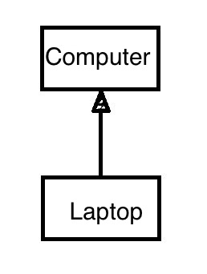
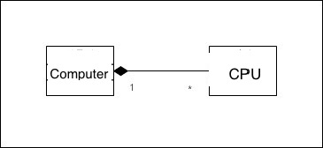
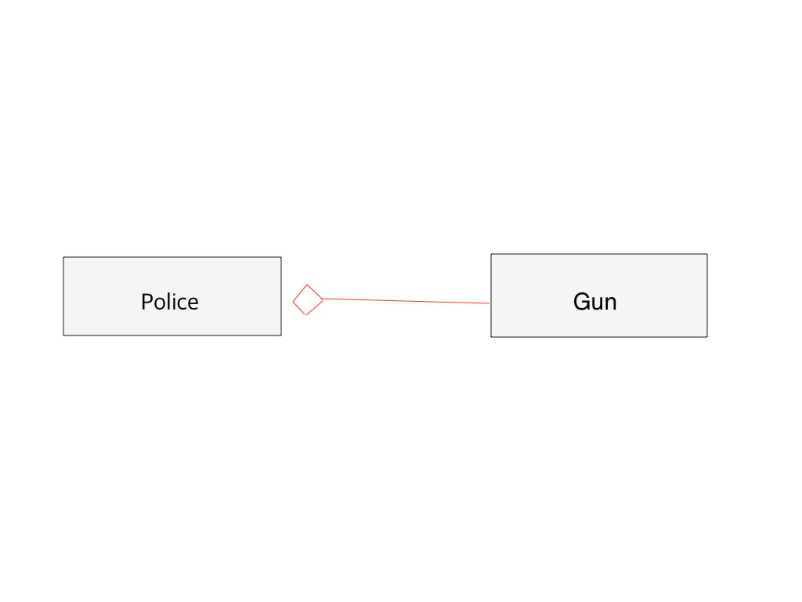
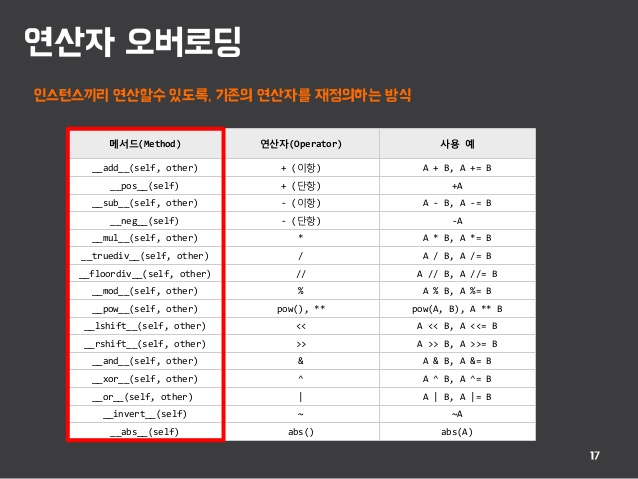

## 클래스 관계
> IS-A, HAS-A가 있음

##### IS-A

* ~은 ~의 한 종류다를 의미

 	* 노트북은 컴퓨터의 한 종류다
* IS-A 관계를 프로그램에서 표현할 때는 상속(inheritance)를 사용
* 상속 관계에서 상속을 하는 클래스를 기본(base) 클래스, 부모(parent) 클래스, 슈퍼(super) 클래스라고 함 
* 상속을 받는 클래스를 파생(derived) 클래스, 자식(child)클래스, 서브(sub) 클래스라고 함

* IS-A상속 예제코드

```
class Computer:
    def __init__(self, cpu, ram):
        self.CPU = cpu
        self.RAM = ram
    
    def browse(self):
        print('browse')
        
    def work(self):
        print('work')
```

* 기본 클래스인 Computer
* 인스턴스 멤버는 CPU, RAM
* 인스턴스 메서드는 browse(), work()

* 자식 클래스인 노트북은 컴퓨터의 모든 멤버와 메서드를 가짐 

##### 어떤 객체가 다른 객체의 모든 특성(멤버)과 기능(메서드)을 가진 상태에서 그 외에 다른 특성이나 기능을 가지고 있다면 상속이 가장 어울림

Laptop class

```
class Laptop(Computer): #1
    def __init__(self, cpu, ram, battery):
        super().__init__(cpu, ram) #2
        self.battery = battery #3
        
    def move(self, to):
        print(f'move {to}')
```

* \#1 Laptop이 Computer를 상속 받음
	* Laptop은 Computer클래스가 갖고 있는 모든 멤버와 메서드를 가짐
	* browse() 메서드나 work() 메서드를 정의하지 않아도 이미 가지고 있음
	* 상속을 하면 코드를 재활용할 수 있어 매우 편리
* `super().__init__(cpu, ram)` : Computer 클래스의 생성자를 호출하면서 두개의 인자를 전달 #2
	* `super`는 현재 클래스의 슈퍼 클래스, 즉 기본 클래스를 의미
	* CPU와 RAM은 기본 클래스의 생성자를 이용해 초기화 했으므로 나머지 멤버인 battery만 할당해주면 됨 #3
* Laptop 클래스만 가지는 move() 메서드를 추가 #4
* 기본 클래스의 모든 멤버와 메서드를 가지면서 자신만의 멤버  혹은 메서드를 가지는 클래스가 있다면 상속을 함



```
>>> lap = Laptop('intel', 16, 'powerful')
>>> lap.browse() #5
>>> lap.work()
>>> lap.move('office') #6

==== 실행결과
browse
work
move office
```

* \#5 상속받은 brose() 메서드를 호출
* Laptop에서 추가한 move() 메서드를 호출 #6

##### HAS-A:합성 또는 통합
> ~이 ~을 가진다 혹은 포함한다

* 컴퓨터는 CPU와 RAM을 가진다.
* 다른 예로, '경찰은 총을 가지고 있다'는 문장
	* A policeman HAS-A gun이라고 표현
	* HAS-A관계가 성립됨
* HAS-A관계는 합성(composition)혹은 통합(aggregation)을 이용해 표현
* `합성` : 컴퓨터와 CPU의 관계를 합성
* `통합` : 경찰과 총의 관계

```
class CPU:
    pass

class RAM:
    pass

class Computer:
    def __init__(self):
        self.cpu = CPU() #1
        self.ram = RAM()
```

* Computer 클래스는 인스턴스 멤버 cpu를 가짐
* 생성자에서 CPU 객체를 생성하여 멤버 cpu에 할당 #1
* Computer 객체가 생성될 때 CPU 객체도 같이 만들어졌다가 Computer 객체가 사라질 때 CPU 객체도 함께 사라짐
* 현실 세계에서도 마찬가지
	* 컴퓨터가 만들어지면서 CPU도 함께 만들어지며, 컴퓨터가 폐기될 때 CPU도 함께 폐기됨
	* Computer 객체와 CPU 객체는 객체의 생명주기가 같고 컴퓨터가 CPU를 소유하고 있는 모양새



* 채워진 다이아몬드 모양은 `합성`을 나타냄

```
class Gun:
    def __init__(self, kind):
        self.kind = kind
    
    def bang(self):
        print('bang bang!')
        

class Police:
    def __init__(self): 
        self.gun = None    #1
    
    def acquire_gun(self, gun): #2
        self.gun = gun    
        
    def release_gun(self): #3
        gun = self.gun
        self.gun = None
        return gun
    
    def shoot(self):
        if self.gun:
            self.gun.bang()
        else:
            print('Unable to shoot')
```

* Police 객체가 만들어질 때 아직 Gun 객체를 가지고 있지 않음 #1
* acquire_gun() 메서드를 통해 Gun 객체를 멤버로 가지게 됨 #2
* release_gun() 메서드를 통해 가지고 있던 총을 반납 #3
* Police 객체와 Gun 객체는 생명주기를 함께 하지 않는 상대적으로 약한 관계
* 이러한 관계를 `통합`이라고 함

Test code

```
p1 = Police()
print('p1 shoots')
p1.shoot()
print('')

# p1은 아직 총을 소유하지 않음
revolver = Gun('Revolver')
# p1이 revolver를 획득
p1.acquire_gun(revolver)
# p1이 총을 소유
# revolver는 None이 됨
revolver = None

print('p1 shoots again')
p1.shoot()
print('')

# p1이 총을 반납
# 더 이상 총을 소유하지 않음
revolver = p1.release_gun()
print('p1 shoots again')
p1.shoot()

==== 실행결과
p1 shoots
Unable to shoot

p1 shoots again
bang bang!

p1 shoots again
Unable to shoot
```

* 경찰 객체가 생성될 때는 총을 가지고 있지 않음
	* p1.shoots한결과 gun의 값이 None이기 때문에 총을 쏠 수 없음
* acquire_gun()메서드를 통해 총을 얻고 나서야 총을 쏠 수 있음
* 이후 release_gun()메서드를 통해 반납하므로 더 이상 쏠 수 없음




* 빈 다이아몬드 모양은 `통합`을 나타냄

### 메서드 오버라이딩과 다형성
> 상속 관계에 있는 다양한 클래스의 객체에서 같은 이름의 메서드를 호출할 때 각 객체가 서로 다르게 구현된 메서드를 호출함으로써 서로 다른 행동, 기능, 결과를 가져오는 것

* 파생 클래스 안에서 상속받은 메서드를 다시 구현하는 것을 `메서드 오버리이딩`이라고 함

```
class Carowner:
    def __init__(self, name):
        self.name = name
        
    def concentrate(self):
        print(f'{self.name} can not do anything eles')
        

class Car:
    def __init__(self, owner_name):
        self.owner = Carowner()
    
    def drive(self): #1
        self.owner.concentrate() #2
        print(f'{self.owner.name} is driving now') #3
```

* Car객체는 반드시 차 주인인 Carowner객체가 운전해야 함
* 차 주인은 운전에만 집중해야 함
* drive() 메서드가 시작하자마자 Carowner 객체의 concentrate() 메서드를 호출해 차 주인이 운전 외에는 아무것도 하지 못하게 함 #2

```
class SelfDriveingCar(Car):
    def drive(self): #4
        print('Car is driving by itself') #5
```

* 자율주행차 클래스
* 차 주인이 운전하지 않고 차가 스스로 운전하므로 상속받은 drive()메서드는 어울리지 않음
* drive() 메서드를 뺸 나머지 멤버나 메서드는 여전히 유효
* Car를 상속받지만 어울리지 않은 drvie()메서드만 재정의 #4
* 메서드만 구현하는, 즉 파생 클래스에서 상속받은 메서드를 다시 구현하는 것을 메서드 오버라이딩(method overriding)이라고 함

```
car = Car('Greg')
car.drive()
print('')

s_car = SelfDriveingCar('john')
s_car.drive()

==== 실행 결과

Greg can not do anything eles
Greg is driving now

Car is driving by itself
```

* 같은 이름의 메서드를 호출해도 호출한 객체에 따라 다른 결과를 내는 것을 `다형성`이라고 함
* 오버라이딩은 다른행동 혹은 기능을 의미
* 기본 클래스 객체와 파생 클래스 객체의 여러 가지 행동(메서드)이 다르다면 IS-A관계가 맞는지 검토해봐야 함

## 추상 클래스
> 독자적으로 인스턴스를 만들 수 없고 함수의 몸체(body)가 없는 추상 메서드(abstract method)를 하나 이상 가지고 있어야 함 

```
from abc import * #1

class Animal(metaclass = ABCMeta):#2
    @abstractmethod 
    def eat(self): #3
        pass
```

* \#1 abc(abstract base class)모듈을 가져옴
* \#2 파이썬의 문법
	* 추상 베이스 클래스 (ABC)를 정의하기 위한 메타 클래스
	* 등록된 ABC class가 정의한 메서드도 호출될 수 없음
* Animal 클래스를 상속받는 모든 파생 클래스는 내부에 eat()메서드를 반드시 오버라이딩 해야함

## 클래스 설계

* 클래스 계층을 설계할 때 고려해야하는 두 가지
	* 공통 부분을 기본 클래스로 묶는다.(코드 재사용 가능)
	* 부모가 추상 클래스인 경우를 제외하고, 파생 클래스에서 기본 클래스의 여러 메서드를 오버라이딩한다면 파생 클래스는 만들지 않는 것이 좋다.

## 연산자 오버로딩
> 클래스 안에서 메서드로 연산자를 새롭게 구현하는 것(다형성의 특별한 형태)

* 다른 객체나 일반적인 피연산자와 연산을 할 수 있음
* 파이썬이 예약한 함수(매직 메서드)등 연산자 오버로딩을 위해 예약된 함수들이 있음
	* \_\_add__()등
	



