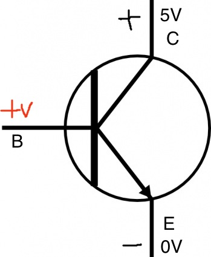
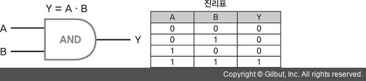
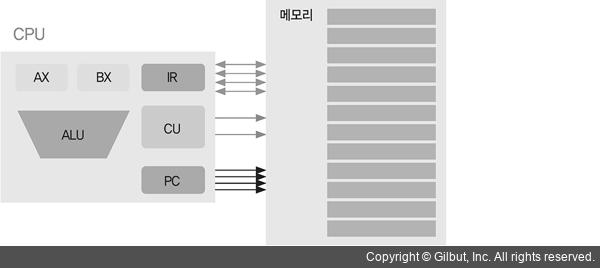
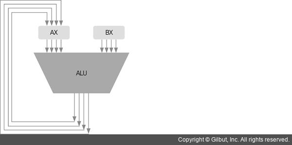
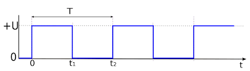

# CPU

##### 컴퓨터가 0과 1을을 구분하는 방법
> 전기적인 특성(전압, 전류, 저항)

* `전압`: 수압과 비슷함
	* 전압이 높음: 수위가 높은 댐안에 갇힌 물의 수압
	* 전압이 낮음: 평평한 곳에 흐르는 물의 수압

* 좁은 통로로 물이 흐름
	* 높은 수압을 가진 물이 좁은 통로로 한 번에 나가려고 하면 통로에 압력이 강해짐
	* 통로가 좁을수록 압력이 세지고 흐르는 물의 양은 줄어든다.

##### 압력:`저항`, 물의 양:`전류`에 해당
> 저항이 세지면 전류는 줄어듦

* `전압 강하` : 높은 전압을 가지고 잇다가 저항을 지나는 순간 전압이 낮아짐
	* 저항을 지나면서 전압이 낮아지는 것

* 컴퓨터가 0과 1을 인식하는 방법: 5V나 5V에 가까운 높은 전압은 1 혹은 true, 0V또는 0V에 가까운 낮은 전압은 0 혹은 false
* 컴퓨터가 상황에 따라 0과 1을 바꾸는 방법: `스위치`를 하나 설치하고 전압을 알맞은 위치에서 측정하면 스위치를 켜거나 끄면서 1과 0을 바꿀 수 있다.
* `스위치`역할을 하는 것이 `트랜지스터`



* 베이스에 전압을 공급
	* 콜렉터에서 이미터(+에서 -로) 전류가 흐름(스위치가 켜짐)
	* 베이스에 0V를 공급 > 전류가 흐르지 않음(스위치가 꺼짐)

#### 컴퓨터는 전압을 통해 0과 1을 알 수 있고, 트랜지스터는 스위치 역할을 하여 전류가 흐르거나 흐르지 않게 한다.

## 논리 게이트
> 컴퓨터에 들어가는 수많은 디지털 회로를 구성하는 가장 기본적인 요소
> 불(bool)함수를 구현하기 위한 회로




* AND 게이트를 설계할 때 주의할 점은 출력 Y가 저항 이후로 설정되면 전압 강하가 생겨 0V 즉, 여전히 `거짓`

* <a href='https://ko.wikipedia.org/wiki/%EB%85%BC%EB%A6%AC_%ED%9A%8C%EB%A1%9C'>그 외 논리 회로</a>

## 조합 논리 회로와 가산기

### CPU의 구성



* `CU(Control Unit)`: 제어 장치
	* 우리가 작성한 코드는 컴퓨터가 이해할 수 있는 기계어로 번역되어 메모리에 저장됨
	* 이후 프로그램이 실행되면 CPU는 이 명령어를 한 줄씩 읽어 들여 실행
	* 이때 어떤 명령어인지 해석, 실행하려고 할 때 CPU의 각파트에 지시를 내리는 역할
* `ALU(Arithmetic Logic Unit)`: 산술 논리 연산 장치
	* 덧셈, 뺄셈 같은 산술연산
	* AND(논리곱), OR(논리합) 같은 논리 연산을 하는곳
	* 그 외: 레지스터(CPU안에 내장된 메모리)
* 가산기 : 조합 논리 회로
* 레지스터 : 순차 논리 회로

##### 조합 논리 회로(Combinational Logic Circuit) : 현재 입력에 의해서만 출력이 결정되는 논리 회로
> 기본 게이트는 모두 조합 논리 회로

* 가산기 : ALU 내부에 위치
 * 레지스터 AX와 BX값을 입력 받음
 * 현재 4비트 CPU를 다루므로 AX와 BX 값도 4비트로 입력
 
  
 
 * 입력 AX와 BX가 덧셈 연산 후 다시 AX로 출력 됨
 * AX에서 A는 Accumulator로 `값을 축적해 나가는`레지스터

### 가산기

* 가산기에는 비트 두 개만 더하는 반가산기(half-adder)
* 캐리(carry)까지 연산에 포함하는 전가산기(full-adder)
* 전가산기는 반가산기 두 개와 OR 게이트 한 개로 이루어짐

##### 반가산기


##### 전가산기


`CI`: Carry In
`CO`: Carry Out

`Carry`: 받아올림 수

* A와 B에 각각 1이 들어올 경우
 * 같은 자릿수끼리 더해 윗자리로 수를 올려줘야 하는 것을 받아올림(carrying)
 * 출력 회로가 두 개라면 1과 0을 각각 출력하겠지만, 출력 회로는 하나뿐
 * 이런 상황에서는 출력 회로에서 아랫자리 수인 0을 출력하고, 윗자리 수인 1은 Carry Out을 통해 출력, 이때 이 윗자리 수를 캐리(받아올림 수)라고 함

##### 덧셈이나 뺄셈 등을 포함한 ALU(산술 논리 장치) 연산은 현재 출력이 오로지 현재 입력에 의해서만 결정된다는 특징이 있음

### 순차 논리 회로와 레지스터
> 현재의 출력이 현재의 입력과 과거의 출력에 따라 정해지는 논리 회로

* AND게이트의 출력 값을 반전시키면 NAND게이트
* 출력이 분기되어 다시 입력으로 들어오는 것
* 입력이 바뀌었다고 해서 출력이 바로 바뀌는 것이 아니라 특정 상황이 되었을 때만 바뀐다는 점과 이를 통해 이전 출력 값이 `유지`된다는 점
* 출력 값이 유지 된다는 특성을 다르게 표현하면 `저장`된다고 할 수 있음
* 플립플롭을 메모리 소자 즉, 메모리를 구성하는 기본 단위라고 부름
* CPU 안에 있는 레지스터는 사실 많은 플립플롭의 묶음

## 클록

* `주파수` : 진자가 1초 동안 왕복한 횟수
	* ex) 1초 동안 2 번 왕복했을 때의 주파수
		* f = 2Hz(2헤르츠) = 2cycle / sec

* `주기` : 진자가 1초동안 두 번왕복했다 or 진자가 한 번 왕복하는 데 0.5초가 걸린다라고 표현

* `클록 속도` : CPU 혹은 프로세서 속도의 지표
	* 1초에 클록이 몇 번 발생했는가를 의미
	* 컴퓨터 내부에는 클록 발생기가 있는데 이 발생기는 일정한 시간에 맞춰 펄스(신호)를 생성



* 상승 에지(상승하는 부분)에 맞춰 인스트럭션을 실행
	* 인스트럭션(instruction) : 우리가 작성한 코드가 CPU에서 실해되기 위해 최종적으로 변환된 기계어 명령어
	* 모든 에지마다 인스트럭션을 하나씩 실행하는 것은 아님
	* 클록 주파수가 높을수록 1초당 상승 에지 수가 높아짐
		* 그만큼 실행되는 인스트럭션 수도 늘어남 
		* CPU의 주파수가 높을수록 연산 속도가 빠른 성능 좋은 컴퓨터


##### 성능을 나타내는 지표 `CPI(Clock cycles Per Instruction)`가 있는데 이는 인스트럭션당 클록 수를 나타낸다.
> 메모리 접근은 높은 클록 수를 요구

* 레지스터는 플립플롭의 묶음
* 출력은 입력과 같은 값을 '전달'
* 레지스터가 클록에 맞춰 결과 값을 저장한다면, 이는 결국 클록에 `동기화`된 것

## 시스템 버스

* `IR(Instruction Register` : 우리가 쓴 코드를 기계어로 번역하면 `명령어`(기계어)로 변환하고 변환된 명령어는 프로그램이 실행되면 메인 메모리에 올려지고 하나씩 실행되는데, 메모리에 있는 명령어를 CPU로 가져와 저장해 두는 곳이 `IR`
* `Program Counter(PC)` : 현재 실행 중인 명령어 다음에 실행될 명령어의 `메모리 주소`를 담고 있음
* `AX`,`BX` : 범용 레지스터
	* 메모리에서 읽어 들인 데이터를 저장 했다가 ALU가 연산할 때 피연산자로 전달하거나 연산 결과 값을 저장할 때 쓰임

##### 시스템 버스의 구성과 특징

* 데이터 버스(Data Bus) : 제어 버스의 신호(Signal)에 따라 데이터를  CPU에서 메모리로 전송하거나 메모리에서 CPU로 전송
	* 데이터 버스는 `양방향`
* 제어 버스(Control Bus) : 데이터를 레지스터로 읽어올지(READ) 아니면 메모리에 쓸지(WRITE) CPU가 메모리에 전달
* 주소 버스(Address Bus) : 메모리에서 레지스터로, 레지스터에서 메모리로 데이터를 전송할 때 필요한 메모리 주소를 전달
	* CPU가 메모리에 알려 주는 형식이므로 `단방향`
* IR에는 명령어가 실행 중
* PC에는 다음에 실행될 명령어가 저장된 주소가 저장
* 다음 명령어를 실행하려면 메모리 -> IR로 명령어를 가져와야 함
	* `FETCH`라고 함
* 다음에 실행할 명령어를 가져오기 위해 제어 버스에는 READ 모드를 전달
* 주소 버스에는 다음에 실행할 명령어가 저장되어 있는 주소를 전달
* 데이터 버스를 통해 IR로 전달(FETCH 2단계)

## 인스트럭션 세트
> CPU가 인식하여 실행할 수 있는 기계어
> 
> 바이너리 형태라 사람이 읽기 어려움

`어셈블리어` : 기계어를 사람이 읽을 수 있도록 일대일로 대응한 무자 형태의 명령어

* 인스트럭션 세트는 CPU마다 다름
* 새로운 CPU를 도입했다면 그 CPU에 적합한 인스트럭션 세트로 다시 프로그래밍 해야함
	* 이러한 불편을 없애고자 C 언어를 비롯한 하이레벨 언어가 탄생
* 컴파일 언어는 작성한 코드는 그대로 두고 작동하는 컴퓨터에 따라 컴파일만 다시 하면 됨

### 명령어의 종류

|명령어|이진 코드|
|---|---|
|ADD|000|
|SUB|001|
|MUL|010|
|DIV|011|
|LOAD(직접 주소방식)|100|
|STORE(직접 주소방식)|101|
|LOAD(간접 주소방식)|110|
|STORE(간접 주소방식)|111|

`LOAD` : 메모리에서 레지스터로 데이터를 가져오는 명령어

`STORE` : 레지스터에서 메모리로 데이터를 저장

### 덧셈과 뺄셈 명령어
> ADD와 SUB 명령어는 명령어 종류 뒤에 2비트가 첫 번째 레지스터, 다음 2비트가 두 번째 레지스터를 가리킴

* 레지스터를 표현하는 비트가 2비트인 이유
	* 범용 레지스터가 AX, BX, CX, DX 네 개라서 2비트면 모두 표현할 수 있기 때문

|레지스터|이진 코드|
|---|---|
|AX|00|
|BX|01|
|CX|10|
|DX|11|

ex) `AX`와 `CX`를 더해 그 값을 첫 번째 피연산자인 `AX`에 저장하라를 코드로

	ADD AX, CX
뺄셈 명령어
	
	SUB AX, CX

### 곱셈과 나눗셈 명령어
> 곱셈 명령어와 나눗셈 명령어는 피연산자가 하나

* 명령어의 구성은 같다 단, 의미는 다름

곱셈 명령어 => AX에 이미 저장된 값에 피연산자 CX 값을 곱한 다음 그 결과를 AX에 저장한다는 뜻
	
	MUL CX

나눗셈 명령어 => AX 값을 피연산자 BX로 나눈 다음 몫을 AX에 저장하고 나머지를 DX에 저장한다는 의미

	DIV BX

## 메모리 접근 명령어

`직접 주소 방식(Direct Addressing Mode)` 

|1|0|0||||||
|---|---|---|---|---|---|---|---|

* 첫 3bit는 명령어(LOAD)
* 그 뒤 2bit는 레지스터
* 마지막 3비트는 메모리

* LOAD 명령어는 메모리에서 레지스터로 데이터를 읽어 들이는 명령어
* 2비트의 레지스터는 범용 레지스터 네 개 중에서 메모리를 저장하려는 위치
* 3비트의 메모리는 데이터가 있는 메모리 주소를 나타냄
* 데이터의 메모리 주소를 직접 저장하는 방식을 `직접 주소 방식`이라고 함

#### 우리가 만든 인스트럭션으로 변환(컴파일)하여 실행되는 과정

```
int A = 5;
int B = 3;
int C = 0;
C = A + B;
```
위 코드를 어셈블리어로 바꿈

```
LOAD AX, A(0x01)
LOAD CX, B(0x2)
ADD AX, CX
STORE AX, C(0x3)
```

* 기계어 100(직접 주소 방식 LOAD)00(레지스터 AX)001(변수 A)은 변수 A의 값인 5를 레지스터 AX로 읽어옴

|1|0|0|0|0|0|0|1|
|---|---|---|---|---|---|---|---|

...

