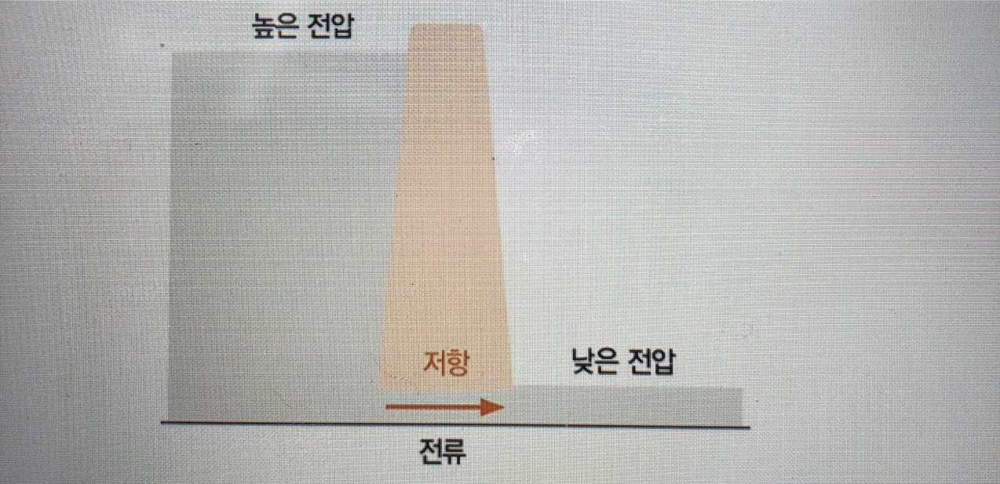
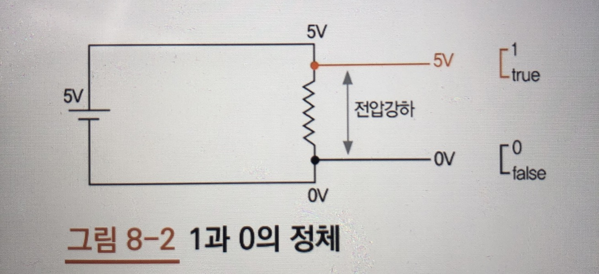
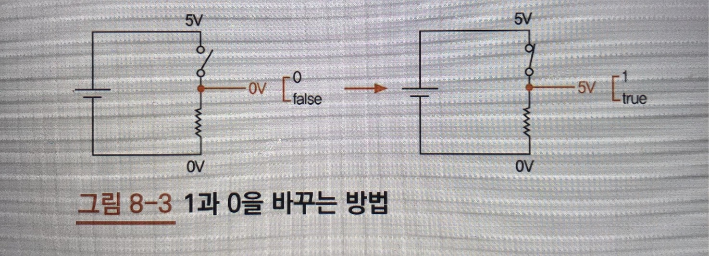
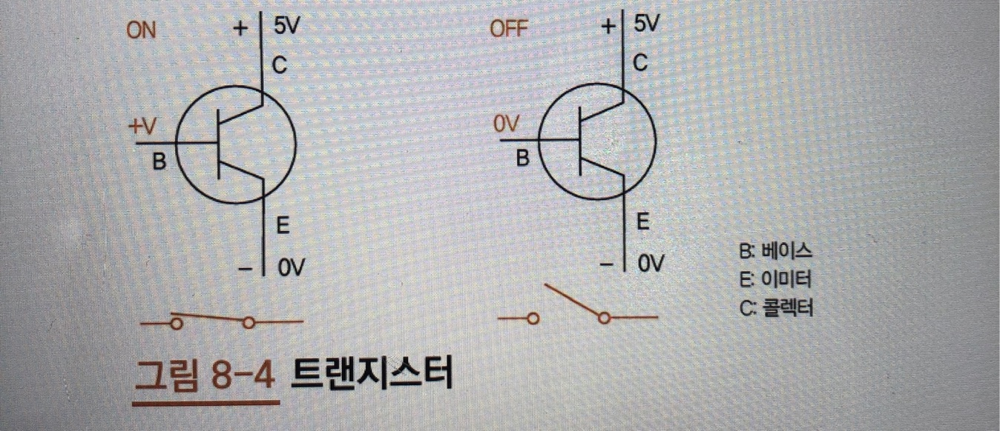
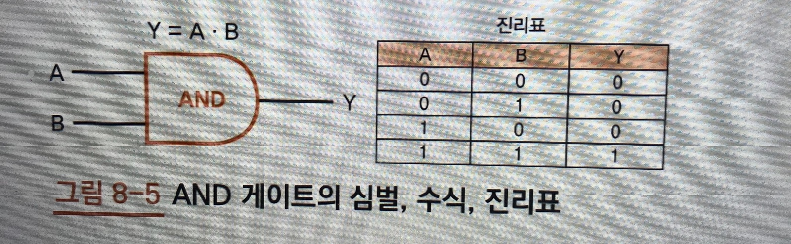
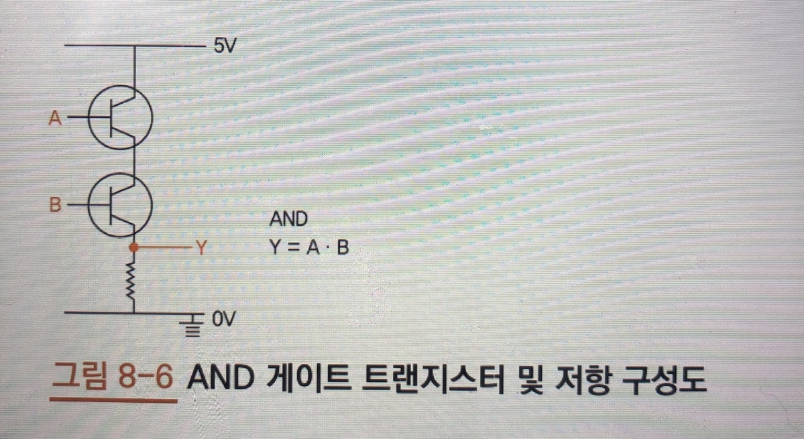
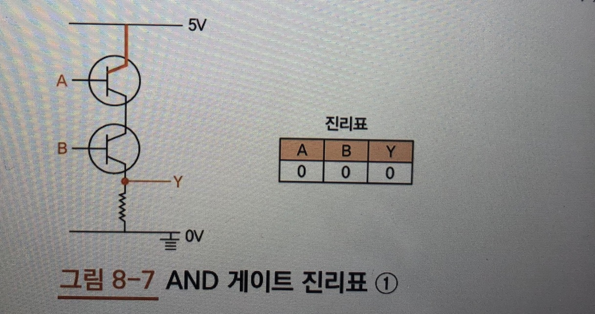

# CPU

## 트랜지스터와 논리 게이트

+ 컴퓨터는 0과 1을 어떻게 구분하나? 컴퓨터도 전자기기니 전기적인 특성떄문이다.

### 전압, 전류, 저항

+ 전기의 특성에는 전압, 전류, 저항이 있다.
	+ 전압은 수압과 비슷함
		+ 예를 들어 전압이 높다는 말은 수위가 높은 댐 안에 갇힌 물의 수압을 떠올리고, 전압이 낮다면 평평한 곳에 흐르는 물의 수압을 떠올리면 편하다.
	+ 저항(압력), 전류(물의양)과 비슷함
		+ 예를들어 좁은 통로로 물이 흐른다고 가정, 높은 수압을 가진 물이 좁은 통로로 한 번에 나가려고 하면 통로에 엄청난 압력이 가해질것이다. 통로가 좁아 질수록 압력이 세고 흐르는 물의 양은 줄어든다. 여기서 압력은 `저항`에 해당하고 물의 양은 `전류`에 해당한다. 저항이 세지면 전류는 줄어든다.
+ 
	+ 댐 안에서 높은 전압을 가지고 있다가 좁은 통로인 저항을 지나는 순간 전압이 완전이 낮아짐, 이렇게 저항을 지나면서 전압이 낮아지는 것을 `전압 강하`라고 한다.
+ 
	+ 5V는 높은 전압 0V는 낮은 전압, 톱니 모양은 저항을 뜻함
	+ 전압이 저항을 지나면 전압 강하가 일어 난다(저항을 만나기 전 5V, 만난후 0V, 전압이 컴퓨터가 0과 1을 인식하는 방법)
	+ 5V나 5V에 가까운 높은 전압은 1 혹은 True로 인식
	+ 0V나 0V에 가까운 낮은 전압은 0 혹은 false로 인식

+ 
	+ 스위치를 하나 설치하고 전압을 알맞는 위치에서 측정하면 1과 0을 바꿀 수 있다.
+ 
	+ 스위치 역할을 하는 것이 `트랜지스터`이다.

### 논리 게이트

+ 논리게이트란? 컴퓨터에 들어가는 수많은 디지털 회로를 구성하는 가장 기본적인 요소
	+ 쉽게 말해 불(bool	) 함수를 구현하기 위한 회로를 논리게이트라 하며, 논리 게이트를 사용해서 논리 연산을 할수도 있다.
	+ 기본 게이트에는 `AND`, `OR`, `XOR`, `NOT` 등이 있다.
	+ 논리 게이트에 들어오는 입력 값에 따른 모든 경우의 수를 나타낸 표를 `진리표라` 한다
	+ 
		+ A와 B는 입력 Y는 출력을 의미
	+ 
		+ AND게이트 구성도
	+ 
		+ A와 B가 0V일때, 다시 말해 두 입력이 모두 거짓일때 전류가 흐르지 않으므로 출력 Y는 0V 즉 거짓
	+ 
		+ A만 참일때, 전류가 흐르지만, 입력 B가 여전히 거짓이므로 아래쪽 트랜지스터에는 전류가 흐르지 않음.
	+ 
		+ 입력 A와 B가 모두 5V 즉, 참이므로 두 스위치가 모두 켜지면서 전류가 흐름
		+ AND 게이트 설계할 때 주의할 점은 출력 Y가 저항(톱니바퀴 모양) 이후 (검은색 작은 동그라미)로 설정되면 전압 강하가 생겨 0V 즉, 여전히 거짓이 된다.
	+ 
		+ AND 게이트를 매번 트랜지스터와 저항으로 표현하면 복잡하므로 단순화하여 나타냄
	+ 
		+ 논리 게이트에는 많은 종류가 있다(OR, NOT, XOR)

## 조합 논리 회로와 가산기

+ 4비트 가산기를 만들기
	+ 조합논리회로, 순차논리회로, 가산기 개념 알기

### CPU의 구성
+ ALU, CU, IR, PC 
	+ CU(Control Unit)는 제어장치
		+ 우리가 작성한 코드는 컴퓨터가 이해할수 있는 언어인 기계어(0과 1로 이루어짐)로 번역되어 메모리에 저장 -> 이후 프로그램이 실행되면 CPU는 이 `명령어를 한줄 씩 읽어 들여 실행`, 이때 **어떤 명령어인지 해석하고 이를 실행하려고 할 때** CPU의 `각파트에 지시를 내리는 역활`을 하는 것이 `제어 장치`이다.
	+ ALU(Arithmetic Logic Unit, 산술 논리 연산)
		+ 덧셈, 뺄셈 같은 산술 연산과 AND(논리곱), OR(논리합) 같은 논리 연산을 하는곳
	+ ALU와 CU를 제외한 AX, BX, IR, PC는 모두 레지스터이다
		+ CPU 안에 내장된 메모리라고 생각하자

> 조합논리회로와 순차논리회로를 이해하면 CPU의 원리를 정확하게 이해할 수 있다.

+ 조합논리회로(Comvinational Login Circuit)
	+ 현재 입력에 의해서만 출력이 결정되는 논리 회로를 말함
+ 가산기는 ALU 내부에 위치하고 레지스터 AX 와 BX값을 입력받음