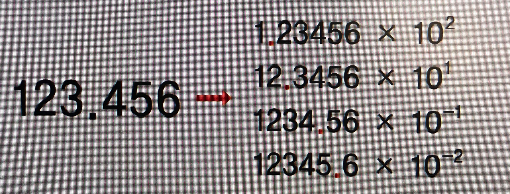

# 실수

### 부동소수점
 

### 단정도와 배정도

+ 단정도(single-precision)는 실수를 32비트(4바이트)로 표현하며 부호 1비트, 지수부 8비트, 가수부 23비트로 구성
+ 배정도(double-precision)는 실수를 64비트(8바이트)로 표현하며 부호 1비트, 지수부 11비트, 가수부 52비트로 구성
+ 실수를 표현하는 데 사용하는 비트 수가 단정도보다 두 배 많은 만큼 정밀도가 높다.(파이썬은 배정도를 사용)

### 정규화
+ 정규화(noramlization)란 소수점 왼쪽에 위치한 가수 부분을 밑수보다 작은 자연수가 되도록 만드는 것

### 옙실론
+ 1.0과 그 다음으로 펴현 가능한 수(representable float)사이의 차이를 말함

## 부동소수점은 지수부에 따라 아주 작은 수와 아주 큰수를 표현할 수 있지만 상황에따라 큰단위의 정수조차 표현 할수 없을때 때도 있다. (표현범위는 넓지만 정밀도가 낮다)