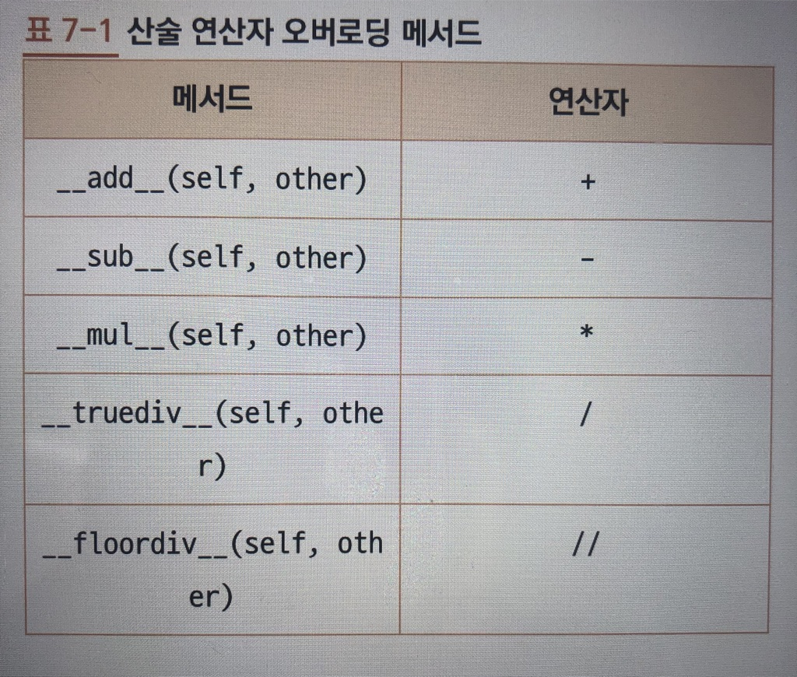

## 클래스

> 클래스와 클래스 사이가 어떤 관계를 형성하는지 흔히 볼수있음

+ 관계를 나타내는 방법으로 `IS-A`, `HAS-A` 가 있다

### IS-A 상속

+ IS-A 는 `~은, ~의 한종류다`를 의미, 예를 들어 (노트북은 컴퓨터의 한 종류이다)
+ IS-A 관계를 프로그램에서 표현할때 상속(inheritance)를 사용.
	+ 상속은 객체 지향의 근간이라고 불릴 만큼 중요하며 유용함, 하지만 IS-A 관계가 아닐때 상속을 하면 클래스를 설계하는데 어렵다.
+ 상속 관계에서 상속을 하는 클래스를 기본(base)클래스, 부모(parent)클래스, 슈퍼(super)클래스라 함
	+ 상속을 받는 클래스를 파생(derived)클래스, 자식(child)클래스, 서스(sub)클래스라고 함

### HAS-A 합성 또는 통합

+ HAS-A 는 `~이 ~을 가진다 혹은 포함한다`를 의미
+ HAS-A 관계는 합성(composition), 통합(aggregation)을 이용해 표현
	+ 합성과 통합은 같은 관계를 나타내는 방법이지만 차이점이 존재함
+ `채워진 다이아몬드` 모양은 `합성`을 나타냄(
+ 
+ `빈 다이아몬드` 모양은 `통합`을 나타냄
+  
### 메서드 오버라이딩과 다향성

+ 객체 지향을 공부한 사람에게 OOP에서 가장 중요한 개념은 다향성(polymorphism)을 언급

> 다향성이란 `상속 관계에 있는 다양한 클래스의 객체에서 같은 이름의 메서드를 호출할때, 각 객체가 서로 다르게 구현된 메서드를 호출함으로써 서로 다른 행동(behavior), 기능, 결과를 가져오는것`을 의미

+ 파생 클래스(derived class)안에서 상속받은 메서드를 다시 구현하는 것을 메서드 오버라이딩(method overriding)이라 한다.

### 메서드 오버라이딩

+ 오버라이딩은 다른 행동 혹은 기능을 의미한다
+ 기본 클래스 객체와 파생 클래스 객체의 여러가지 행동(메서드)이 다르면 IS-A 관계가 맞는지 다시 한번 검토

### 다형성

+ 추상 클래스(abstract class)
	+ 유저 프로그래머가 xxx 클래스의 인스턴스를 애초에 만들지 못하게하고 싶으면 xxx클래스를 추상 클래스로 만들면된다
	+ 추상 클래스는 독자적으로 인스턴스를 만들수 없고 함수의 몸체가 없는 추상메서드를 하나이상 가지고 있어야함
	+ 추상 클래스를 상속받은 파생 클래스에서는 추상 메서드를 반드시 오버라이딩해야함, 그렇지 않으면 파생클래스도 추상 클래스가 되어 인스턴스를 만들수없음
	+ abs(abstract base class) 모듈불러서사용

			예)
			from abc import *
			
			class xxxx(metaclass = ABCMeta):
				@abstractmethod
				def xxx(self):
					pass
					
			메서드 구현부를 pass로 해야 함수 몸체를 비워두면 메서드가 추상 메서드가 된다.

### 클래스 설계

+ 클래스 계층을 설계할 때는 두가지를 고려해야함
	+ 1. 공통 부분을 기본 클래스로 묶는다. 그래야 코드를 재사용할수 있음
	+ 2. 부모가 추상 클래스인 경우를 제외하고 파생클래스에서 기본 클래스의 여러 메서드를 오버라이딩한다면 파생 클래스는 만들지 않는 것이 좋다

### 연산자 오버로딩

+ 연산자 오버로딩(operator overloading)은 클래스 안에서 메서드로 연산자를 새롭게 구현하는 것으로 `다양성의 특별한 형태`
	+ 연산자 오버로딩을 사용하면 다른 객체나 일반적인 피연산자와 연산을 할 수 있다.

+ 산술 연산자 오버로딩 메서드
+  
	+ ex) 예약함수`_ _add_ _()`메서드를 사용하여 계산할때 순서가바뀌어 계산이 안되면 예약함수 `_ _radd_ _()`메서드 추가해주기
	+ 파이썬은 산술 연산자와 논리 연산자를 비롯해 다양한 연산자 오버로딩 메서드를 제공( 문법책 참고 )
	+ 연산자 오버로딩을 할 때는 오버로딩하는 연산자에 의한 연산을 직관적으로 이해할 수 있어야 한다는 점 주의
	
	
	
	
	
	
	
	
	
	
	
	
	
	
	